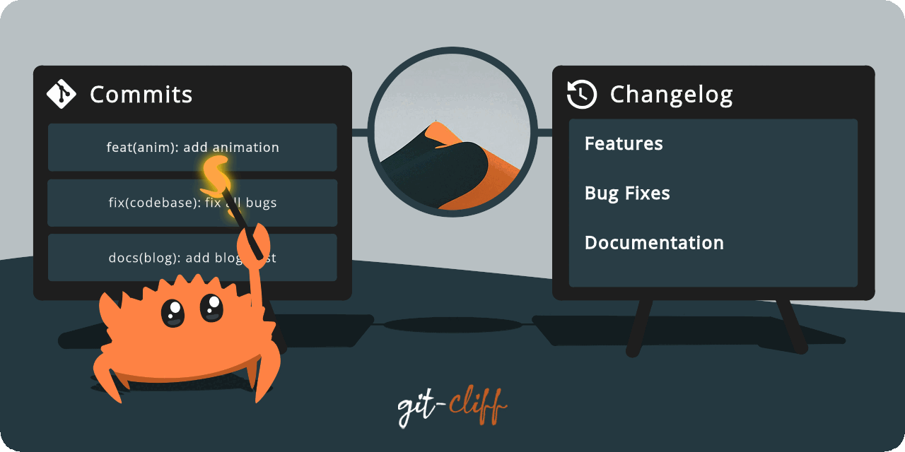

# Changelog

## [unreleased]
### Features

- **(roku-agent-runtime)** modular system prompt with tool guidance and project instructions (by @[itscheems](https://github.com/itscheems)) - ([a595acf](https://github.com/itscheems/Roku/commit/a595acfba642d63b46fed6d098d63a5365ae616e))
- **(roku-agent-runtime)** port compaction to conversation message model (by @[itscheems](https://github.com/itscheems)) - ([8f4f544](https://github.com/itscheems/Roku/commit/8f4f544ad3b2914dd0da0e22f71fb35569c64b50))
- **(roku-agent-runtime)** inject environment context into system prompt and strengthen command.run (by @[itscheems](https://github.com/itscheems)) - ([1c01720](https://github.com/itscheems/Roku/commit/1c01720591d265dacdb5c33035eef95b3015c9b9))
- **(roku-cmd)** wire multi-provider LLM selection via runtime config (by @[itscheems](https://github.com/itscheems)) - ([477c0cb](https://github.com/itscheems/Roku/commit/477c0cb9eb7b8c6fc1b3885f8cd7c6a57415e3fa))
- **(roku-plugin-llm)** add per-provider runtime config and router builders (by @[itscheems](https://github.com/itscheems)) - ([af2715f](https://github.com/itscheems/Roku/commit/af2715fc88dca6246ebbf5c0aec2e69796f23489))
- **(roku-plugin-llm)** add OpenAI Chat Completions API provider with streaming tool calls (by @[itscheems](https://github.com/itscheems)) - ([fcdee2b](https://github.com/itscheems/Roku/commit/fcdee2b25b5c56535c4a33ce6ef3a45ea45e17da))
- **(roku-plugin-llm)** add Anthropic Messages API provider with streaming tool_use (by @[itscheems](https://github.com/itscheems)) - ([6c878ae](https://github.com/itscheems/Roku/commit/6c878ae819c4a58bcc36347a5a484b725fe53c40))

### Bug Fixes

- **(roku-agent-runtime)** guard adjust_split_for_tool_pairs against out-of-bounds (by @[itscheems](https://github.com/itscheems)) - ([db8771b](https://github.com/itscheems/Roku/commit/db8771b35034447c61c5dc8ab09f5dccffd3921f))
- **(roku-agent-runtime)** stabilize project instructions and improve token estimation (by @[itscheems](https://github.com/itscheems)) - ([3d8cd1f](https://github.com/itscheems/Roku/commit/3d8cd1f0340f28f0ee23e0a16e8d3694f8ada3ac))
- **(roku-agent-runtime)** validate streaming LLM result and preserve compaction pairing (by @[itscheems](https://github.com/itscheems)) - ([82bac4c](https://github.com/itscheems/Roku/commit/82bac4c3e6e8e5ee95cf9402153171a125ef2e1f))
- **(roku-agent-runtime)** sanitize environment values and use per-step cwd (by @[itscheems](https://github.com/itscheems)) - ([ad3e6ef](https://github.com/itscheems/Roku/commit/ad3e6ef8a929997635707fdaa97bd06beb70030d))
- **(roku-agent-runtime)** complete classifier LLM deletion (resolve agent conflict) (by @[itscheems](https://github.com/itscheems)) - ([9fa69c3](https://github.com/itscheems/Roku/commit/9fa69c3cbe2174cd0f6b314120349dd82bc93387))

### Refactor

- **(roku-agent-runtime)** delete deterministic classifier and simplify request pipeline (by @[itscheems](https://github.com/itscheems)) - ([8f829e0](https://github.com/itscheems/Roku/commit/8f829e0f30416210efaf4aeea1e7bb67a731df62))
- **(roku-agent-runtime)** rewrite turn loop from ContextProjection to conversation messages (by @[itscheems](https://github.com/itscheems)) - ([6825c34](https://github.com/itscheems/Roku/commit/6825c34bc45c3bc375192801452d90a388eacf94))
- **(roku-agent-runtime)** remove classifier LLM calls and grounding gate (by @[itscheems](https://github.com/itscheems)) - ([5801aeb](https://github.com/itscheems/Roku/commit/5801aeb8eae88a6c0a0cab8e213da39fd7eec384))
- **(roku-agent-runtime)** delete JSON-in-prompt fallback, native tool_use only (by @[itscheems](https://github.com/itscheems)) - ([90a9d2f](https://github.com/itscheems/Roku/commit/90a9d2f93835931a472381604e08c8feb45504b3))
- **(roku-plugin-tools)** delete LLM-wrapping meta-tools (by @[itscheems](https://github.com/itscheems)) - ([f989c54](https://github.com/itscheems/Roku/commit/f989c5438dacc66e9d67a6d34f00d067bbf55503))
- **(workspace)** merge roku-runtime-service into roku-agent-runtime (by @[itscheems](https://github.com/itscheems)) - ([ec273c5](https://github.com/itscheems/Roku/commit/ec273c5505be1eb8d6c1d4194e15c1675f7c7ac8))
- **(workspace)** merge 3 over-split crates (17 → 14 members) (by @[itscheems](https://github.com/itscheems)) - ([740c6b3](https://github.com/itscheems/Roku/commit/740c6b3d3e9247cc4cd41c5c875c08170ec2cbfb))
- **(workspace)** delete 6 unused crates (23 → 17 members) (by @[itscheems](https://github.com/itscheems)) - ([d0c5f3a](https://github.com/itscheems/Roku/commit/d0c5f3a806a92f46ebcdb09201d94a5f6eda30cb))

## [v0.0.11] - 2026-04-09

### Features

- **(roku-agent-runtime)** wire native tool_use end-to-end in tool loop (by @[itscheems](https://github.com/itscheems)) - ([ac41cbf](https://github.com/itscheems/Roku/commit/ac41cbff7c900bbdbfb887ec4931f5d53325f7c9))
- **(roku-agent-runtime)** parse native tool_use into NextStepDecision (by @[itscheems](https://github.com/itscheems)) - ([c40cdb0](https://github.com/itscheems/Roku/commit/c40cdb09168514f07813c31e681c5b87de7183ca))
- **(roku-agent-runtime)** add Serialize derive to LoopEvent (by @[itscheems](https://github.com/itscheems)) - ([6df0d07](https://github.com/itscheems/Roku/commit/6df0d077c3625d19035b11dd5976947304fbb6bc))
- **(roku-agent-runtime,roku-plugin-tools)** liberate command.run as general-purpose shell adapter (by @[itscheems](https://github.com/itscheems)) - ([61e3a8f](https://github.com/itscheems/Roku/commit/61e3a8f4f5860ec5af3e336c48a301d43b31554d))
- **(roku-cmd)** add session-persistent CLI with pipe mode (by @[itscheems](https://github.com/itscheems)) - ([e570db9](https://github.com/itscheems/Roku/commit/e570db9786602b61b0e35186c96f405c0514ce47))
- **(roku-plugin-llm)** implement OpenRouter tool_use request and response (by @[itscheems](https://github.com/itscheems)) - ([92c4bc4](https://github.com/itscheems/Roku/commit/92c4bc48be242b86c9d16cf95716f84013baf393))
- **(roku-plugin-llm)** add tool definition and tool_use types to provider layer (by @[itscheems](https://github.com/itscheems)) - ([6c0d123](https://github.com/itscheems/Roku/commit/6c0d123f66da51d088586c9a3201a30a68b0b476))
- **(roku-plugin-tools)** add context lines and type filter to fs.grep (by @[itscheems](https://github.com/itscheems)) - ([605982b](https://github.com/itscheems/Roku/commit/605982be58fa481623070bd9db0fc497dbdfae28))

### Bug Fixes

- **(roku-agent-runtime)** strip tool definitions from streaming requests (by @[itscheems](https://github.com/itscheems)) - ([73de5e8](https://github.com/itscheems/Roku/commit/73de5e83d800728c0ecfd33ce3f06d02096b3d62))
- **(roku-agent-runtime)** remove escalation fallback to non-existent general.execute (by @[itscheems](https://github.com/itscheems)) - ([ae4b74d](https://github.com/itscheems/Roku/commit/ae4b74d3d7d1b96f0080a854fcee4327be166352))
- **(roku-agent-runtime)** prevent GitHub URL from triggering blind skill install route (by @[itscheems](https://github.com/itscheems)) - ([bc8035a](https://github.com/itscheems/Roku/commit/bc8035ad1218435a64ccf5800c90c15f9c6d33da))
- **(roku-agent-runtime,roku-plugin-tools)** make non-terminal tool errors recoverable by LLM (by @[itscheems](https://github.com/itscheems)) - ([bf8867c](https://github.com/itscheems/Roku/commit/bf8867c422deb445cd798885dfa066a1d42bbd4e))
- **(roku-agent-runtime,roku-plugin-tools)** harden code-level defaults to match production config (by @[itscheems](https://github.com/itscheems)) - ([048ca20](https://github.com/itscheems/Roku/commit/048ca20397646cd46d6c3bbae7fc0f425035c884))
- **(roku-plugin-telegram,roku-runtime-service)** clean up progress notice and failure message presentation (by @[itscheems](https://github.com/itscheems)) - ([a69854f](https://github.com/itscheems/Roku/commit/a69854fb3a3ebb24f8acc091bc395fea87f09c0e))

### Refactor

- **(roku-agent-runtime)** convert grounding from gate to hint (by @[itscheems](https://github.com/itscheems)) - ([04e96ad](https://github.com/itscheems/Roku/commit/04e96ad4c8e443773232a40ef7f4e783d3745e08))
- **(roku-agent-runtime)** demote route classifier to soft context hint (by @[itscheems](https://github.com/itscheems)) - ([548f448](https://github.com/itscheems/Roku/commit/548f448ed67fe945d37d5035ea4feb09dec03bc6))
- **(roku-plugin-tools)** make all enabled tools always visible to LLM (by @[itscheems](https://github.com/itscheems)) - ([e4dc5e9](https://github.com/itscheems/Roku/commit/e4dc5e9efa2b09ab7a86e8fcd517c85b569023c9))
- **(roku-plugin-tools,roku-agent-runtime)** remove general.execute and downgrade meta-tools (by @[itscheems](https://github.com/itscheems)) - ([48123ac](https://github.com/itscheems/Roku/commit/48123ace06128543b466eac9df3675c2441ef450))

### Miscellaneous Tasks

- **(config)** exclude gitignored directories from hawkeye format (by @[itscheems](https://github.com/itscheems)) - ([b38cfbb](https://github.com/itscheems/Roku/commit/b38cfbbc2ada0341947410838bbd8d1dfee252fe))

## [v0.0.10] - 2026-04-08

### Features

- **(roku-agent-runtime)** wire LLM streaming and call_tools prompt into tool loop (by @[itscheems](https://github.com/itscheems)) - ([4d4bee3](https://github.com/itscheems/Roku/commit/4d4bee30e9ecfdfa43d975b27bf1bd52949a7416))
- **(roku-agent-runtime)** add LLM-assisted semantic compaction with mechanical fallback (by @[itscheems](https://github.com/itscheems)) - ([016ba2b](https://github.com/itscheems/Roku/commit/016ba2b85e573d68df1c302f94584616e6f6599b))
- **(roku-agent-runtime)** add concurrent tool execution with batch call_tools action (by @[itscheems](https://github.com/itscheems)) - ([ffa467f](https://github.com/itscheems/Roku/commit/ffa467ff5f62ca91cab59d2d3dddf5d5389177ef))
- **(roku-cmd)** wire MCP tools into runtime catalog and tool pool (by @[itscheems](https://github.com/itscheems)) - ([110a50c](https://github.com/itscheems/Roku/commit/110a50c2ce42142f2d9ed39f7cab7894b39e2c62))
- **(roku-cmd)** add AwaitingUser detection, /compact command, and UX improvements to Telegram handler (#99) (by @[itscheems](https://github.com/itscheems))  - (#99) - ([d96ba58](https://github.com/itscheems/Roku/commit/d96ba58d8b6a5ea57ed4ed95ad48c6387659bdfc))
- **(roku-cmd)** add multi-turn continuity and AwaitingUser to `roku chat` (by @[itscheems](https://github.com/itscheems)) - ([2d9eef4](https://github.com/itscheems/Roku/commit/2d9eef42bffdfbcd1384fd150ce467018cba0bf7))
- **(roku-cmd)** add interactive `roku chat` REPL command (by @[itscheems](https://github.com/itscheems)) - ([acc6e52](https://github.com/itscheems/Roku/commit/acc6e5281030ce8f8e93c4f12e0d49a9b019dcb5))
- **(roku-cmd)** wire LoopEvent streaming into telegram handler (by @[itscheems](https://github.com/itscheems)) - ([2065d3a](https://github.com/itscheems/Roku/commit/2065d3ab2b0dca30a3f910405a4498403dbbe443))
- **(roku-cmd)** tokio runtime entry with live-once streaming output (by @[itscheems](https://github.com/itscheems)) - ([6d93817](https://github.com/itscheems/Roku/commit/6d938174f8abb57c2bc8e6e7403971f9b7933808))
- **(roku-plugin-llm)** add streaming method to LlmProvider trait and LlmRouter (by @[itscheems](https://github.com/itscheems)) - ([6afb6cd](https://github.com/itscheems/Roku/commit/6afb6cdc60e70422606aba17e5a38d72e87ce17e))
- **(roku-plugin-llm)** async LLM provider with streaming support (by @[itscheems](https://github.com/itscheems)) - ([a38a139](https://github.com/itscheems/Roku/commit/a38a1396edf67a8f01b589e34b9c7ca5ef62b944))
- **(roku-plugin-mcp)** implement MCP client foundation with stdio transport (by @[itscheems](https://github.com/itscheems)) - ([4430c1f](https://github.com/itscheems/Roku/commit/4430c1f680dd5819d33ab1a4ad2537d767176809))
- **(roku-plugin-memory-sqlite)** implement FTS5 long-term memory backend and set as default (#98) (by @[itscheems](https://github.com/itscheems))  - (#98) - ([98647c8](https://github.com/itscheems/Roku/commit/98647c856f87f90995b508b354557b31bed04962))
- **(roku-plugin-tools)** integrate Tavily Search as default web search provider (#97) (by @[itscheems](https://github.com/itscheems))  - (#97) - ([77a1868](https://github.com/itscheems/Roku/commit/77a18682c372101d64aff74dc807caabcecb7152))
- **(roku-plugin-tools)** replace command allowlist with 3-level execution policy (by @[itscheems](https://github.com/itscheems)) - ([7781657](https://github.com/itscheems/Roku/commit/77816572e9e7eb07ff141ad55c50c389f2093b31))

### Bug Fixes

- **(roku-agent-runtime)** reject truncated streaming responses (by @[itscheems](https://github.com/itscheems)) - ([fe4a9e0](https://github.com/itscheems/Roku/commit/fe4a9e097b6e740566daeeb12fe37ec867e3e90c))
- **(roku-agent-runtime)** handle all terminal conditions in CallTools batch dispatch (by @[itscheems](https://github.com/itscheems)) - ([9171b6e](https://github.com/itscheems/Roku/commit/9171b6eb5482bea5efa2bcc9015a02a6027a9bdb))
- **(roku-agent-runtime)** declare tokio sync feature explicitly (by @[itscheems](https://github.com/itscheems)) - ([d063035](https://github.com/itscheems/Roku/commit/d06303575976dd7866125558ae48d959b0b83c44))
- **(roku-cmd)** use rt.spawn instead of rt.block_on for telegram requests (by @[itscheems](https://github.com/itscheems)) - ([daaafd6](https://github.com/itscheems/Roku/commit/daaafd678d4d7784416949339179e398936e7337))
- **(roku-cmd)** resolve telegram bot runtime panic on request (by @[itscheems](https://github.com/itscheems)) - ([2f26e2a](https://github.com/itscheems/Roku/commit/2f26e2a22ebfbab903c4d41990af8bc8e47169f2))
- **(roku-plugin-memory-openviking)** wrap response.text() in run_blocking (by @[itscheems](https://github.com/itscheems)) - ([6bb0f93](https://github.com/itscheems/Roku/commit/6bb0f93eae40f4e38c7bc00d470592a398b8bc45))
- **(roku-plugin-memory-openviking)** isolate blocking HTTP from async runtime (by @[itscheems](https://github.com/itscheems)) - ([85fbab4](https://github.com/itscheems/Roku/commit/85fbab4d94f1a2e9218b0a5be98624348f933247))

### Refactor

- **(roku-agent-runtime)** derive compact LLM budget from CompactConfig (by @[itscheems](https://github.com/itscheems)) - ([85ad0ea](https://github.com/itscheems/Roku/commit/85ad0eaa5e1e3538032b6085dcccf032fbe1bd46))
- **(roku-agent-runtime)** deduplicate compact check, fix CallTools batch gaps (by @[itscheems](https://github.com/itscheems)) - ([5f723ff](https://github.com/itscheems/Roku/commit/5f723ffb20da05fb6351f07ad8a5f0640a89cf91))
- **(roku-agent-runtime)** migrate execute_tool_loop and decide_tool_loop_next_step to async (by @[itscheems](https://github.com/itscheems)) - ([3afe166](https://github.com/itscheems/Roku/commit/3afe1664b266c29d7844dc81f0538060f354cfb4))
- **(roku-cmd)** migrate CLI parsing to clap derive API (by @[itscheems](https://github.com/itscheems)) - ([c593243](https://github.com/itscheems/Roku/commit/c593243cf0ca9845d9d0bc3ff2fbe0f1b3b8d956))
- **(roku-runtime-service)** add bridge_async_to_sync helper and wire async runtime calls (by @[itscheems](https://github.com/itscheems)) - ([cdbd408](https://github.com/itscheems/Roku/commit/cdbd408110888fe3e99cfab62b63815761eed433))

### Testing

- **(roku-plugin-mcp)** add E2E integration tests with real MCP server (by @[itscheems](https://github.com/itscheems)) - ([4692288](https://github.com/itscheems/Roku/commit/4692288f774077dcd0a1a2854eda9c826d46bf62))

### Miscellaneous Tasks

- update .gitignore (by @[itscheems](https://github.com/itscheems)) - ([e6cdc01](https://github.com/itscheems/Roku/commit/e6cdc0162412e0bf61c9ec081763b755e780d484))
- remove accidentally staged worktree directories (by @[itscheems](https://github.com/itscheems)) - ([3dc2b80](https://github.com/itscheems/Roku/commit/3dc2b80bf843108ddeacd6b150480f214475377c))
- update runtime.toml (by @[itscheems](https://github.com/itscheems)) - ([30bd2b1](https://github.com/itscheems/Roku/commit/30bd2b1be34d9d02ca28873faf2000a1fc49a32e))

## [v0.0.9] - 2026-04-06

### Features

- **(roku-agent-runtime)** add post-compact context restoration and memory write-back (by @[itscheems](https://github.com/itscheems)) - ([72858d5](https://github.com/itscheems/Roku/commit/72858d53edee1d29e0fa8f0874509ea634aadf1b))
- **(roku-agent-runtime)** implement history truncation and compact execution (by @[itscheems](https://github.com/itscheems)) - ([b7ae3d9](https://github.com/itscheems/Roku/commit/b7ae3d99447f8422e64410d879456ea2a7e587e6))
- **(roku-agent-runtime)** add token estimation and compact trigger for context management (by @[itscheems](https://github.com/itscheems)) - ([fbea742](https://github.com/itscheems/Roku/commit/fbea742867a8db0746f4b9a2e23f7bb46e678615))
- **(roku-plugin-tools)** add declarative grounding metadata to tool descriptors (by @[itscheems](https://github.com/itscheems)) - ([31ac5f5](https://github.com/itscheems/Roku/commit/31ac5f56940a6d55647f356a9e22d6a36052571d))
- **(roku-plugin-tools)** implement EPIC-0 core work tools (by @[itscheems](https://github.com/itscheems)) - ([7287664](https://github.com/itscheems/Roku/commit/72876643e5f3d6e8332aa9fbc6dce19f1f0ac18d))
- **(workspace)** implement PRD-03 memory write-back enablement and PRD-04 pending loop durable store (by @[itscheems](https://github.com/itscheems)) - ([ecf21c0](https://github.com/itscheems/Roku/commit/ecf21c06511678b16a1e5fe3948571451b5fd923))

### Bug Fixes

- **(roku-agent-runtime)** reject NaN and infinite compact_threshold_ratio in validation (by @[itscheems](https://github.com/itscheems)) - ([2849fe6](https://github.com/itscheems/Roku/commit/2849fe6b42010587b55259db9f3bb4f5629d82e3))
- **(roku-plugin-memory-sqlite)** complete migration safety for pending loop store cutover (by @[itscheems](https://github.com/itscheems)) - ([3643c71](https://github.com/itscheems/Roku/commit/3643c71206f2feaf0fd49f57d5b6b88e4ed88643))
- **(roku-plugin-memory-sqlite)** add legacy fallback for pending loop migration (by @[itscheems](https://github.com/itscheems)) - ([6a82bb0](https://github.com/itscheems/Roku/commit/6a82bb0e216ba1e282277eb1fbb832b9dac5191c))
- **(roku-plugin-tools)** adapt digest formatting for sha2 0.11 (by @[itscheems](https://github.com/itscheems)) - ([b038c76](https://github.com/itscheems/Roku/commit/b038c7671efb3f4dbd71e4a0feb9ea0e2c854ff8))
- **(roku-plugin-tools)** address code review findings from PR #54 (by @[itscheems](https://github.com/itscheems)) - ([2d217ea](https://github.com/itscheems/Roku/commit/2d217ea1ab6e2cd9da044d6f06b337b07e476f83))
- **(roku-validation-plane)** skip visible_tools check for compact boundary steps in trace validation (by @[itscheems](https://github.com/itscheems)) - ([e044ae0](https://github.com/itscheems/Roku/commit/e044ae05c453f809437d481eaf76bcb1b0021004))
- **(scripts)** tighten PR Check workflow triggers (by @[itscheems](https://github.com/itscheems)) - ([f371cc3](https://github.com/itscheems/Roku/commit/f371cc3ebf07373db6685f037696f0d3f3ae9b14))

### Refactor

- **(roku-agent-runtime)** eliminate tool_name comparisons with ExtractionHint enum (by @[itscheems](https://github.com/itscheems)) - ([b084aad](https://github.com/itscheems/Roku/commit/b084aadfae65d7b81dd750ece6b4d08f2df4b566))
- **(roku-agent-runtime)** migrate grounding match arms to descriptor-based lookup (by @[itscheems](https://github.com/itscheems)) - ([e3ec1c9](https://github.com/itscheems/Roku/commit/e3ec1c980093de38bab26a21e3abb2ac88ebf56d))
- **(roku-agent-runtime)** consolidate EPIC-5 migration comments (by @[itscheems](https://github.com/itscheems)) - ([76cc895](https://github.com/itscheems/Roku/commit/76cc8953a447643b4b527c1b909340a47cd2d3d9))
- **(roku-common-types)** remove legacy Task.graph, TaskGraph, and Task.planning_mode_hint (by @[itscheems](https://github.com/itscheems)) - ([b89e7c1](https://github.com/itscheems/Roku/commit/b89e7c10687b407262fcd166fc12445cb637177a))
- **(workspace)** remove AgentContext.memory_context and planning mode compatibility pipeline (by @[itscheems](https://github.com/itscheems)) - ([e81dc3e](https://github.com/itscheems/Roku/commit/e81dc3e492a704eba9391b4c9c563813df1707bf))

### Styling

- **(roku-plugin-tools)** normalize formatting (by @[itscheems](https://github.com/itscheems)) - ([8d6c675](https://github.com/itscheems/Roku/commit/8d6c6759d779ab05400d316e638882260593f8b2))

### Miscellaneous Tasks

- update .gitignore (by @[itscheems](https://github.com/itscheems)) - ([32495b3](https://github.com/itscheems/Roku/commit/32495b3e2d9857f15ca54cec782923f703b23d97))

## [v0.0.8] - 2026-04-05

### Features

- **(roku-agent-runtime)** project working summary separately (by @[itscheems](https://github.com/itscheems)) - ([24ed7de](https://github.com/itscheems/Roku/commit/24ed7dedbcf73ee1812bbaca605704af0de4e228))
- **(roku-agent-runtime)** add loop working summary state (by @[itscheems](https://github.com/itscheems)) - ([4bf8c99](https://github.com/itscheems/Roku/commit/4bf8c99aa2d08a406bed60eb77c32a6ff90e428c))
- **(roku-agent-runtime)** capture execution trace evidence (by @[itscheems](https://github.com/itscheems)) - ([35fe9a8](https://github.com/itscheems/Roku/commit/35fe9a85683f0fa434d062079d369b241c00b10e))
- **(roku-agent-runtime)** reuse shared command execution seam (by @[itscheems](https://github.com/itscheems)) - ([61686c3](https://github.com/itscheems/Roku/commit/61686c3751c522eebdcc23d16e33cf3cb211b996))
- **(roku-cmd)** route once resume through the shared pending-loop substrate (by @[itscheems](https://github.com/itscheems)) - ([77a9455](https://github.com/itscheems/Roku/commit/77a9455121f7c65df711891ffda16e8b00cee326))
- **(roku-cmd)** align effective memory write-back behavior (by @[itscheems](https://github.com/itscheems)) - ([0e83dbf](https://github.com/itscheems/Roku/commit/0e83dbfd6f91d0f0d7729ebf1c3489af73ab9410))
- **(roku-common-types)** add execution approval contracts (by @[itscheems](https://github.com/itscheems)) - ([30d3ab9](https://github.com/itscheems/Roku/commit/30d3ab9c1c6a98f1a070e1c11df45bf9750bada9))
- **(roku-memory)** add provider-neutral session management subsystem (by @[itscheems](https://github.com/itscheems)) - ([f7a6ad3](https://github.com/itscheems/Roku/commit/f7a6ad352b1d662adff1d3cd96451770a3fc07e1))
- **(roku-plugin-host)** gate command invocations with policy decisions (by @[itscheems](https://github.com/itscheems)) - ([365cc54](https://github.com/itscheems/Roku/commit/365cc547a1346a56bdacd87d585ead0206cdd345))
- **(roku-plugin-telegram)** use runtime approval messages directly (by @[itscheems](https://github.com/itscheems)) - ([a7c040f](https://github.com/itscheems/Roku/commit/a7c040fbfac7c2325e2952fa7eaa2b624210adce))
- **(roku-plugin-telegram)** add multi-session control flow to telegram runtime (by @[itscheems](https://github.com/itscheems)) - ([743224e](https://github.com/itscheems/Roku/commit/743224e61777341c8d2f6bd1e61129d2984ca29f))
- **(roku-plugin-tools)** add runtime-visible availability snapshot (by @[itscheems](https://github.com/itscheems)) - ([a11201b](https://github.com/itscheems/Roku/commit/a11201b27156953bafc4e61c7fae4649950e7b5b))
- **(roku-runtime-service)** propagate structured runtime memory sections (by @[itscheems](https://github.com/itscheems)) - ([30583ee](https://github.com/itscheems/Roku/commit/30583ee7acdae77eed304505c5e966ffb1c1df84))
- **(roku-runtime-service)** trace stopped pending loops and successful resumes (by @[itscheems](https://github.com/itscheems)) - ([d50a47f](https://github.com/itscheems/Roku/commit/d50a47f5880408d00f3de95dde423e961603d35c))
- **(roku-runtime-service)** add pending-loop snapshot adapter (by @[itscheems](https://github.com/itscheems)) - ([6931884](https://github.com/itscheems/Roku/commit/6931884baed3be4a6c69cb9691cf59ba07db7354))
- **(roku-runtime-service)** freeze and resume approved executions (by @[itscheems](https://github.com/itscheems)) - ([e0a6881](https://github.com/itscheems/Roku/commit/e0a688185ec97a0e262dcf573a992e3b2cb58e64))
- **(scripts)** add Ralph run-level final eval (by @[itscheems](https://github.com/itscheems)) - ([49aa26f](https://github.com/itscheems/Roku/commit/49aa26f85cea76060c49bbee289a5897babaec71))
- **(scripts)** add semantic eval gate to Ralph loop (by @[itscheems](https://github.com/itscheems)) - ([e4cc603](https://github.com/itscheems/Roku/commit/e4cc603352b1faa34e05e55f6592b522f5cf3be9))
- **(scripts)** add Ralph Codex workflow loop (by @[itscheems](https://github.com/itscheems)) - ([ebb3db2](https://github.com/itscheems/Roku/commit/ebb3db2b57b97688ed8fdbfbab087a291d09e6c4))
- **(scripts)** show OpenViking provider status in doctor (by @[itscheems](https://github.com/itscheems)) - ([0b3f39b](https://github.com/itscheems/Roku/commit/0b3f39bf4384008846b636ae93153ef899f92457))

### Bug Fixes

- **(cd)** replace release rust toolchain action (#28) (by @[itscheems](https://github.com/itscheems)) - ([20e41e5](https://github.com/itscheems/Roku/commit/20e41e5d42ce1b9b1fc45f91c19e4d0d9f5f5605))
- **(ci)** install native build toolchain on runner (by @[itscheems](https://github.com/itscheems)) - ([9ca10f3](https://github.com/itscheems/Roku/commit/9ca10f3b7fcbc6a8569d851f56d1165e66ea65ba))
- **(config)** harden arc runner toolchain runtime (by @[itscheems](https://github.com/itscheems)) - ([7e004f9](https://github.com/itscheems/Roku/commit/7e004f9c9a5a1dc76d31a20ac17f78b36be73384))
- **(roku-agent-runtime)** keep tool projection mirror-only (by @[itscheems](https://github.com/itscheems)) - ([f9b3d56](https://github.com/itscheems/Roku/commit/f9b3d5616d39b31221cc456edcc9166990484d47))
- **(roku-agent-runtime)** keep route and loop visibility on one snapshot (by @[itscheems](https://github.com/itscheems)) - ([3dfe3de](https://github.com/itscheems/Roku/commit/3dfe3de1d20055588b7bd298542d8a2cd713f963))
- **(roku-agent-runtime)** disable builtin raw observation fallback (by @[itscheems](https://github.com/itscheems)) - ([023a259](https://github.com/itscheems/Roku/commit/023a259396cb7bf7fa4fcb0494214ee6ad322a77))
- **(roku-agent-runtime)** preserve exact inputs for approved replays (by @[itscheems](https://github.com/itscheems)) - ([9e25115](https://github.com/itscheems/Roku/commit/9e25115e59ae9fd275123f7518b77d519a6ad9af))
- **(roku-agent-runtime)** preserve direct-route approval payloads (by @[itscheems](https://github.com/itscheems)) - ([3807142](https://github.com/itscheems/Roku/commit/38071424759b812af25a12d2257bc9c9a05791a5))
- **(roku-cmd)** align telegram request resume with shared substrate (by @[itscheems](https://github.com/itscheems)) - ([da352a0](https://github.com/itscheems/Roku/commit/da352a056ceb4f12f725beb48c603a1c9df340d0))
- **(roku-cmd)** report effective memory write-back state (by @[itscheems](https://github.com/itscheems)) - ([0677a80](https://github.com/itscheems/Roku/commit/0677a80edb1db639ed0535e0123caf5ee3cec0d3))
- **(roku-cmd)** restore request env overrides after execution (by @[itscheems](https://github.com/itscheems)) - ([b32fbb5](https://github.com/itscheems/Roku/commit/b32fbb5db81cdf08dfd3441d3023921c6206b452))
- **(roku-common-types)** add path approval reason code (by @[itscheems](https://github.com/itscheems)) - ([50e45a0](https://github.com/itscheems/Roku/commit/50e45a05962d09d22556f1aceb28ddc1dddb2b64))
- **(roku-plugin-host)** support approved scope overrides (by @[itscheems](https://github.com/itscheems)) - ([fc50d8a](https://github.com/itscheems/Roku/commit/fc50d8aaab861110a1ac24b11fd81931627e539e))
- **(roku-plugin-memory-openviking)** harden runtime-state visibility and clears (by @[itscheems](https://github.com/itscheems)) - ([b4732d6](https://github.com/itscheems/Roku/commit/b4732d6bf482f6cd3d65ffb13dc5e7a27bee5e4e))
- **(roku-plugin-memory-openviking)** repair runtime-state provider compatibility (by @[itscheems](https://github.com/itscheems)) - ([a7bdc3b](https://github.com/itscheems/Roku/commit/a7bdc3bc5311134ba5bd35dd2279d225993e86b7))
- **(roku-plugin-telegram)** add approval button emoji (by @[itscheems](https://github.com/itscheems)) - ([6259670](https://github.com/itscheems/Roku/commit/625967078ea882523ce084e1c903767308f2f778))
- **(roku-plugin-telegram)** simplify sessions control output (by @[itscheems](https://github.com/itscheems)) - ([37ec34c](https://github.com/itscheems/Roku/commit/37ec34ccb6cbb0df9b47416101fd646713818c09))
- **(roku-plugin-tools)** route out-of-scope paths through approval (by @[itscheems](https://github.com/itscheems)) - ([75e621c](https://github.com/itscheems/Roku/commit/75e621cfb63fd839c5a1fbeb04bc54f1366f8f18))
- **(roku-plugin-tools)** keep canonical execution for untrusted commands (by @[itscheems](https://github.com/itscheems)) - ([a36488f](https://github.com/itscheems/Roku/commit/a36488face40760800166e371ac7c6d3816e35c2))
- **(roku-runtime-service)** deauthorize legacy graph replay (by @[itscheems](https://github.com/itscheems)) - ([0eb7133](https://github.com/itscheems/Roku/commit/0eb713350ac1db314762c378a6387570722932d6))
- **(roku-runtime-service)** keep direct-route approval resume graphless (by @[itscheems](https://github.com/itscheems)) - ([6a20289](https://github.com/itscheems/Roku/commit/6a202898531d4fab3c8fe1e370083c12130536c0))
- **(roku-runtime-service)** render working memory in runtime layers (by @[itscheems](https://github.com/itscheems)) - ([d0986b8](https://github.com/itscheems/Roku/commit/d0986b83eb16b11ca6c1df237bddbdb094eb70f4))
- **(roku-runtime-service)** resume approved filesystem access (by @[itscheems](https://github.com/itscheems)) - ([3499126](https://github.com/itscheems/Roku/commit/3499126b9644bb42b7bc39d36e43fae24a62ce31))
- **(roku-runtime-service)** freeze direct-route command approvals (by @[itscheems](https://github.com/itscheems)) - ([24e376a](https://github.com/itscheems/Roku/commit/24e376ac1e659ab19f0a94a0b576f06c8dfa47d7))
- **(scripts)** allow no-op Ralph story passes (by @[itscheems](https://github.com/itscheems)) - ([091c1f3](https://github.com/itscheems/Roku/commit/091c1f3d8bc81bb70b60af71cda92861df409072))
- **(scripts)** require explicit FINAL adoption for dirty final worktrees (by @[itscheems](https://github.com/itscheems)) - ([41ead38](https://github.com/itscheems/Roku/commit/41ead38636acb2805e0b9a137d9d1ea887695dcd))
- **(scripts)** raise Ralph retry budget (by @[itscheems](https://github.com/itscheems)) - ([385ed1f](https://github.com/itscheems/Roku/commit/385ed1fdcd60758e4307bffcb224ad523dcfc9f9))
- **(scripts)** require story commits before marking progress (by @[itscheems](https://github.com/itscheems)) - ([c51889c](https://github.com/itscheems/Roku/commit/c51889cf4bd54ccc36b7e2887560ea9130663eb3))
- **(scripts)** archive completed Ralph state (by @[itscheems](https://github.com/itscheems)) - ([68250c3](https://github.com/itscheems/Roku/commit/68250c3c8f21fa2d9b5796caa35006a4a094ad18))
- **(scripts)** harden ralph codex runner recovery (by @[itscheems](https://github.com/itscheems)) - ([173732b](https://github.com/itscheems/Roku/commit/173732b2f884eb2f100f584a206e9f2f58766d51))
- **(scripts)** manage dev openviking lifecycle in script (by @[itscheems](https://github.com/itscheems)) - ([d5ac35a](https://github.com/itscheems/Roku/commit/d5ac35a187b6d2f40e3c78f951506d59c5b6c974))
- **(scripts)** enable openviking features for live services (by @[itscheems](https://github.com/itscheems)) - ([222a9d9](https://github.com/itscheems/Roku/commit/222a9d9bc1dc5876e6bfced66e932470bfaf383e))

### Refactor

- **(roku-agent-runtime)** drop legacy raw observation fallback (by @[itscheems](https://github.com/itscheems)) - ([325e1b6](https://github.com/itscheems/Roku/commit/325e1b63a12836c9ee3beb479edfff160e5a0d94))
- **(roku-cmd)** centralize telegram session ux defaults (by @[itscheems](https://github.com/itscheems)) - ([aa355e9](https://github.com/itscheems/Roku/commit/aa355e9dd43554d60d723bce6aee72a3f369740b))
- **(roku-plugin-tools)** split command.run execution pipeline (by @[itscheems](https://github.com/itscheems)) - ([2c0d1e0](https://github.com/itscheems/Roku/commit/2c0d1e0314d53968af7f5ccec46d9f4d786a01ee))
- **(roku-runtime-service)** demote planning-mode fallback to a compatibility shell (by @[itscheems](https://github.com/itscheems)) - ([dcb4563](https://github.com/itscheems/Roku/commit/dcb45638d49173de3e45cb47a0f84c113e91a1eb))
- **(roku-runtime-service)** extract legacy approval compatibility helper (by @[itscheems](https://github.com/itscheems)) - ([f5b191e](https://github.com/itscheems/Roku/commit/f5b191ea863fbd2b536048a63e597fdb52256b99))
- **(roku-runtime-service)** render continuity and recall as named sections (by @[itscheems](https://github.com/itscheems)) - ([9bafaa1](https://github.com/itscheems/Roku/commit/9bafaa1b24ddb92c5a2e22be1608dc825b0e41ab))
- **(roku-runtime-service)** add named runtime memory layers (by @[itscheems](https://github.com/itscheems)) - ([d816a9d](https://github.com/itscheems/Roku/commit/d816a9d85e606a9ef885773c94066494945c2b42))
- **(roku-runtime-service)** extract runtime loop owner seam (by @[itscheems](https://github.com/itscheems)) - ([7290f64](https://github.com/itscheems/Roku/commit/7290f641b1115a616189b84cb7f423d23b3a4c14))

### Documentation

- **(workspace)** add default issue labels (by @[itscheems](https://github.com/itscheems)) - ([37d260f](https://github.com/itscheems/Roku/commit/37d260fd4bb782f6b97dfdc16f4d942f999a8e6c))
- **(workspace)** add GitHub contribution templates (by @[itscheems](https://github.com/itscheems)) - ([4742afa](https://github.com/itscheems/Roku/commit/4742afa5e4b25b3dd7a2fcf839d40285b42737f1))

### Testing

- **(roku-agent-runtime)** add missing-input ask-user coverage (by @[itscheems](https://github.com/itscheems)) - ([e88c954](https://github.com/itscheems/Roku/commit/e88c954343fa1cbf852a5dc39a8acff8c854dbd9))
- **(roku-agent-runtime)** add candidate-selection ask-user coverage (by @[itscheems](https://github.com/itscheems)) - ([e059cdd](https://github.com/itscheems/Roku/commit/e059cdd19c0a7b516e663bd709c94ad88368955b))
- **(roku-agent-runtime)** add freeform ask-user resume coverage (by @[itscheems](https://github.com/itscheems)) - ([648181e](https://github.com/itscheems/Roku/commit/648181ebd641291d361887deca413dfe9ec9ceda))
- **(roku-agent-runtime)** lock ambiguous filesystem boundary regression (by @[itscheems](https://github.com/itscheems)) - ([3f706c9](https://github.com/itscheems/Roku/commit/3f706c95e972cdf0ff71ccd7a8641aa2faa6ff34))
- **(roku-cmd)** isolate env-backed once runtime tests (by @[itscheems](https://github.com/itscheems)) - ([900d616](https://github.com/itscheems/Roku/commit/900d6169a50d19823c427011b6adb31f4dc5d063))
- **(roku-cmd)** cover telegram bridge resume regression (by @[itscheems](https://github.com/itscheems)) - ([341e9ec](https://github.com/itscheems/Roku/commit/341e9ec4327532f2f95e89f9ed96911bbfe8673f))
- **(roku-cmd)** cover api submit resume on shared substrate (by @[itscheems](https://github.com/itscheems)) - ([5b13040](https://github.com/itscheems/Roku/commit/5b13040ac8030799e2cf0048c1cb562c28ffb0e9))
- **(roku-runtime-service)** mark historical replay resume as legacy-owned (by @[itscheems](https://github.com/itscheems)) - ([4b30c18](https://github.com/itscheems/Roku/commit/4b30c18a5b0d2ef621ed178c298470ec55b111c9))
- **(roku-runtime-service)** prove planning fallback skips pending-loop resume (by @[itscheems](https://github.com/itscheems)) - ([00d7918](https://github.com/itscheems/Roku/commit/00d791844952ce6f4ec3ef4dfcafdf2526346d32))
- **(roku-runtime-service)** prove direct approval resume stays on the direct boundary (by @[itscheems](https://github.com/itscheems)) - ([a3a21eb](https://github.com/itscheems/Roku/commit/a3a21eb2334e32d998e128834e939675fde79e34))
- **(roku-runtime-service)** cover compatibility fallback route markers (by @[itscheems](https://github.com/itscheems)) - ([ce1433d](https://github.com/itscheems/Roku/commit/ce1433da7c45c77129d21d2e2544495ede644997))
- **(roku-runtime-service)** cover direct runtime route markers (by @[itscheems](https://github.com/itscheems)) - ([e589f37](https://github.com/itscheems/Roku/commit/e589f370a9334d320c5af82120fe73ef74607d80))
- **(roku-runtime-service)** cover effective write-back matrix (by @[itscheems](https://github.com/itscheems)) - ([97e7985](https://github.com/itscheems/Roku/commit/97e7985a68ec926a373aa8f64325269e7d2125ad))
- **(roku-runtime-service)** cover loop resume after reconstruction (by @[itscheems](https://github.com/itscheems)) - ([d90fc34](https://github.com/itscheems/Roku/commit/d90fc342387f8ee9d2e924108c961606093aec13))
- **(roku-runtime-service)** add visible-resource projection guardrails (by @[itscheems](https://github.com/itscheems)) - ([36e0174](https://github.com/itscheems/Roku/commit/36e0174f1e335ac8df14e6307f576964d39b3d61))
- **(roku-runtime-service)** add pause and stale-discard trace guardrails (by @[itscheems](https://github.com/itscheems)) - ([74fccb0](https://github.com/itscheems/Roku/commit/74fccb060579d72a3743576bcc2a018b4378b7d3))
- **(roku-runtime-service)** add direct-route terminal trace guardrails (by @[itscheems](https://github.com/itscheems)) - ([8ec9f19](https://github.com/itscheems/Roku/commit/8ec9f198125f554402b5f7413b0dfffda0496955))
- **(workspace)** pin command.run invocation-time gating boundary (by @[itscheems](https://github.com/itscheems)) - ([9002f34](https://github.com/itscheems/Roku/commit/9002f34ddebba826575bacd7c596e0f5f514c0ac))
- **(workspace)** mark shared visibility proof owners (by @[itscheems](https://github.com/itscheems)) - ([67e4063](https://github.com/itscheems/Roku/commit/67e4063af6b057c754d6b9e64207710731b4a22b))

### Miscellaneous Tasks

- **(config)** harden tool version probes (by @[itscheems](https://github.com/itscheems)) - ([93f97ef](https://github.com/itscheems/Roku/commit/93f97effe2bc82f9f7bb01bda2a0e78b888018db))
- **(config)** harden arc workflow stability (by @[itscheems](https://github.com/itscheems)) - ([0195ac6](https://github.com/itscheems/Roku/commit/0195ac67917eb3e11133640853209d13a1703cd7))
- **(config)** reduce rust cache upload time (by @[itscheems](https://github.com/itscheems)) - ([4c90e03](https://github.com/itscheems/Roku/commit/4c90e032915cde77b4e81b7a182276e0b88ba593))
- **(config)** keep arc values out of tree (by @[itscheems](https://github.com/itscheems)) - ([b55449b](https://github.com/itscheems/Roku/commit/b55449bb74aea4b34d80c8622e393f35ef126137))
- **(config)** preinstall arc runner toolchain (by @[itscheems](https://github.com/itscheems)) - ([984df2f](https://github.com/itscheems/Roku/commit/984df2f8438a3533e8c0e56bd3ae979f6a74cbda))
- **(config)** ignore local AGENTS metadata (by @[itscheems](https://github.com/itscheems)) - ([8596569](https://github.com/itscheems/Roku/commit/8596569bc247fcd48030b67bedb8cf28b9b99987))
- **(scripts)** align Ralph timeouts to 30 minutes (by @[itscheems](https://github.com/itscheems)) - ([80ff31d](https://github.com/itscheems/Roku/commit/80ff31d9b3a27639a584a285e7f41d292b18324e))
- **(workflows)** move jobs to self-hosted runners (by @[itscheems](https://github.com/itscheems)) - ([6f6e6e8](https://github.com/itscheems/Roku/commit/6f6e6e8183bfcba9626d67ad9f70ca4cfff7ffff))
- **(workspace)** ignore .agents directory (by @[itscheems](https://github.com/itscheems)) - ([2b6629e](https://github.com/itscheems/Roku/commit/2b6629e3e657fca301a5465f2dbf6d08c31c50c7))
- remove unused runner matrix (by @[itscheems](https://github.com/itscheems)) - ([524ecef](https://github.com/itscheems/Roku/commit/524ecef3a622f27408ed7bc1fa716e17d7e32fb0))
- move workflows to arc runners (by @[itscheems](https://github.com/itscheems)) - ([4df9fa6](https://github.com/itscheems/Roku/commit/4df9fa68c7e06ae4ae73d7206bb79e77ecc2016e))

## [v0.0.6] - 2026-03-18

### Features

- **(deploy)** add docker build scripts and shell checks (by @[itscheems](https://github.com/itscheems)) - ([ec21948](https://github.com/itscheems/Roku/commit/ec219488f3b0080bad644b09203fa39d0ed41798))
- **(deploy)** support multi-arch docker builds (by @[itscheems](https://github.com/itscheems)) - ([a71853e](https://github.com/itscheems/Roku/commit/a71853e5e28937ec3df929c4d0040c1acded834c))
- **(roku-agent-runtime)** route skill installs through workers (by @[itscheems](https://github.com/itscheems)) - ([a391138](https://github.com/itscheems/Roku/commit/a391138b6e4e7801d01f86ec88671d0d80dae63e))
- **(roku-agent-runtime)** route built-in workers through tool runtime (by @[itscheems](https://github.com/itscheems)) - ([9283cc7](https://github.com/itscheems/Roku/commit/9283cc76377c999526dac302f6a35b4e39828042))
- **(roku-agent-runtime)** add capability-dispatched worker registry (by @[itscheems](https://github.com/itscheems)) - ([27b0dbe](https://github.com/itscheems/Roku/commit/27b0dbef6512f60b2e5a15fea137c409a77e821d))
- **(roku-api-gateway)** expose replay diagnostics (by @[itscheems](https://github.com/itscheems)) - ([ec7c1b4](https://github.com/itscheems/Roku/commit/ec7c1b4c1d73fcb12e4e9d5815f06138bbc4ced0))
- **(roku-api-gateway)** add artifact content and download endpoints (by @[itscheems](https://github.com/itscheems)) - ([3ddaff0](https://github.com/itscheems/Roku/commit/3ddaff0f3fe93e38832661fa0251bd54f2439ce4))
- **(roku-api-gateway)** expose task artifacts and experiment state (by @[itscheems](https://github.com/itscheems)) - ([fec043a](https://github.com/itscheems/Roku/commit/fec043a8bdd47b48bdc792277e40121c6c0cd54e))
- **(roku-api-gateway)** add approval decision endpoints (by @[itscheems](https://github.com/itscheems)) - ([efe460b](https://github.com/itscheems/Roku/commit/efe460bf8f545b2627413ce41666573c03e2c5c5))
- **(roku-api-gateway)** bind runtime service executor (by @[itscheems](https://github.com/itscheems)) - ([37b9926](https://github.com/itscheems/Roku/commit/37b9926824ecf968c8bca09eb92ec1cde38e2701))
- **(roku-api-gateway)** add actix HTTP routes and executor boundary (by @[itscheems](https://github.com/itscheems)) - ([08c2cd2](https://github.com/itscheems/Roku/commit/08c2cd247a74824304c988bd73eb85ecb14487d8))
- **(roku-cmd)** use sqlite adapter for telegram memory state (by @[itscheems](https://github.com/itscheems)) - ([4a1f21c](https://github.com/itscheems/Roku/commit/4a1f21c685536a4b7c3cd79b2b513fa5ed280528))
- **(roku-cmd)** wire OpenViking memory backend commands (by @[itscheems](https://github.com/itscheems)) - ([fb083a6](https://github.com/itscheems/Roku/commit/fb083a635dd695a2dfd2912ed75721524b2760e2))
- **(roku-cmd)** prepare managed openviking config at startup (by @[itscheems](https://github.com/itscheems)) - ([8f50bca](https://github.com/itscheems/Roku/commit/8f50bca257dfd73d6f7a263838a2d4b71ce4e220))
- **(roku-cmd)** add telegram preview command (by @[itscheems](https://github.com/itscheems)) - ([3213774](https://github.com/itscheems/Roku/commit/3213774bfcd5463fdf3c11865d350660c9f8ff12))
- **(roku-cmd)** add direct skill registry commands (by @[itscheems](https://github.com/itscheems)) - ([d84330a](https://github.com/itscheems/Roku/commit/d84330a28e8e220462be1078895c6ed77db926d0))
- **(roku-cmd)** configure project-local skill storage (by @[itscheems](https://github.com/itscheems)) - ([47adc65](https://github.com/itscheems/Roku/commit/47adc65928d4f3294fe53c11d6bf598a2fb9257b))
- **(roku-cmd)** add artifact and replay ops commands (by @[itscheems](https://github.com/itscheems)) - ([75870dd](https://github.com/itscheems/Roku/commit/75870ddb0258a279d7a396fe6f92657fa5425b9f))
- **(roku-cmd)** add task and approval ops commands (by @[itscheems](https://github.com/itscheems)) - ([55ca6c1](https://github.com/itscheems/Roku/commit/55ca6c1ada182d3edbd3a4d1a1d01594145c92a4))
- **(roku-cmd)** add api gateway service mode (by @[itscheems](https://github.com/itscheems)) - ([bba41bf](https://github.com/itscheems/Roku/commit/bba41bf3d960be8e59c888af88c68cf0f4eff96c))
- **(roku-cmd)** add planning mode override flags (by @[itscheems](https://github.com/itscheems)) - ([2f00d19](https://github.com/itscheems/Roku/commit/2f00d19034a6452cf39bd597aa32417490a25d26))
- **(roku-cmd)** wire session-aware planning and file logging (by @[itscheems](https://github.com/itscheems)) - ([e8402be](https://github.com/itscheems/Roku/commit/e8402be9d4ea87a3c8c8ac6aaade078f3a9e5924))
- **(roku-common-types)** add artifact and experiment contracts (by @[itscheems](https://github.com/itscheems)) - ([8a65f57](https://github.com/itscheems/Roku/commit/8a65f570917396a287f390d72c456cda6f1f6d73))
- **(roku-common-types)** track completed nodes for DAG resume (by @[itscheems](https://github.com/itscheems)) - ([fec4726](https://github.com/itscheems/Roku/commit/fec47261ba92510ef47719371e52c907afc61997))
- **(roku-common-types)** add approval and task checkpoint contracts (by @[itscheems](https://github.com/itscheems)) - ([faf3be0](https://github.com/itscheems/Roku/commit/faf3be0ad8785ad15154907de29925433266c092))
- **(roku-common-types)** add serde-ready runtime contracts (by @[itscheems](https://github.com/itscheems)) - ([83cb1c7](https://github.com/itscheems/Roku/commit/83cb1c7f5d9b0822a078ca734793f0db7d434748))
- **(roku-connectors-telegram)** support inline planning commands (by @[itscheems](https://github.com/itscheems)) - ([5aebc9d](https://github.com/itscheems/Roku/commit/5aebc9d39a545c08a6d6684238117ec26ed8c6a1))
- **(roku-connectors-telegram)** simplify telegram user-facing responses (by @[itscheems](https://github.com/itscheems)) - ([ebdb798](https://github.com/itscheems/Roku/commit/ebdb798b2c9a7f324dd078ce6676638d5e49df92))
- **(roku-connectors-telegram)** add progress receipts (by @[itscheems](https://github.com/itscheems)) - ([e1127c2](https://github.com/itscheems/Roku/commit/e1127c2982d396df441b560440e01979afe47565))
- **(roku-connectors-telegram)** add rich attachment rendering (by @[itscheems](https://github.com/itscheems)) - ([c54e4ce](https://github.com/itscheems/Roku/commit/c54e4ce9d23bf999a84677a565fd17454a26f6a7))
- **(roku-connectors-telegram)** support approval callback actions (by @[itscheems](https://github.com/itscheems)) - ([e78b39d](https://github.com/itscheems/Roku/commit/e78b39d0cc0f8c553142bc8fb34cee4fc56df20b))
- **(roku-connectors-telegram)** add live telegram polling bootstrap (by @[itscheems](https://github.com/itscheems)) - ([5d552c9](https://github.com/itscheems/Roku/commit/5d552c955102b7eb242861367c702ac4127e8f05))
- **(roku-connectors-telegram)** add webhook and outbound adapters (by @[itscheems](https://github.com/itscheems)) - ([a6fe665](https://github.com/itscheems/Roku/commit/a6fe665868c622a06ca529c3fb4f26da54c6ef63))
- **(roku-control-plane)** add provider-neutral control-plane core (by @[itscheems](https://github.com/itscheems)) - ([c8a857a](https://github.com/itscheems/Roku/commit/c8a857ac33d684f7b4badd65afaa72b0ff8d8268))
- **(roku-entry-registry)** assemble entry runtime bundles (by @[itscheems](https://github.com/itscheems)) - ([d84267e](https://github.com/itscheems/Roku/commit/d84267e3428af346c8cadbf16ccbd22f839a7f79))
- **(roku-execution-graph-builder)** compile conditional graph edges (by @[itscheems](https://github.com/itscheems)) - ([8c00b51](https://github.com/itscheems/Roku/commit/8c00b51ae5f190e84f04fb05e0ea33b14a3d946e))
- **(roku-execution-graph-builder)** inject retry and dead-letter helpers (by @[itscheems](https://github.com/itscheems)) - ([d3fb73a](https://github.com/itscheems/Roku/commit/d3fb73a75b2ada13bd27ce7eaa17aa46f7a50798))
- **(roku-execution-graph-builder)** add aggregation gate (by @[itscheems](https://github.com/itscheems)) - ([e5b4471](https://github.com/itscheems/Roku/commit/e5b44714f113c58da109e74b08ba7cad9ab6aab1))
- **(roku-execution-graph-builder)** compile dependency-aware task graphs (by @[itscheems](https://github.com/itscheems)) - ([3094518](https://github.com/itscheems/Roku/commit/30945181e857bdc6705af3ac25963acd7c2873fa))
- **(roku-execution-graph-builder)** add DAG scheduler modules (by @[itscheems](https://github.com/itscheems)) - ([eac64cb](https://github.com/itscheems/Roku/commit/eac64cbe1904dd9efdc71dfe8332f624186dc681))
- **(roku-llm-adapter)** add provider resilience controls (by @[itscheems](https://github.com/itscheems)) - ([d2cc2b6](https://github.com/itscheems/Roku/commit/d2cc2b63fce4ee5ee2c0836e8c97628906288312))
- **(roku-llm-adapter)** add openrouter model chain and chat roles (by @[itscheems](https://github.com/itscheems)) - ([f59fd6e](https://github.com/itscheems/Roku/commit/f59fd6eaff61d5d45a3399d306ae4ed1ec32fb81))
- **(roku-llm-adapter)** add openrouter live runtime path (by @[itscheems](https://github.com/itscheems)) - ([9310390](https://github.com/itscheems/Roku/commit/9310390a19c07adbbd347fc27694cc8021902939))
- **(roku-llm-adapter)** add risk and budget-aware provider routing (by @[itscheems](https://github.com/itscheems)) - ([be72c46](https://github.com/itscheems/Roku/commit/be72c4612b1cc932ef536d30670d84060c0601fc))
- **(roku-memory)** add provider-neutral entry registry API (by @[itscheems](https://github.com/itscheems)) - ([6c7c208](https://github.com/itscheems/Roku/commit/6c7c208b737af46c3abea2cd1faf055897bcaff7))
- **(roku-memory)** own provider-neutral memory config and test backends (by @[itscheems](https://github.com/itscheems)) - ([0a93344](https://github.com/itscheems/Roku/commit/0a933448f19c62aa4ac84da5049bac32d506cfc6))
- **(roku-memory)** add entry registry resolution (by @[itscheems](https://github.com/itscheems)) - ([af4aefc](https://github.com/itscheems/Roku/commit/af4aefc71c5b6237b5a83bf9477d93183dca4dc0))
- **(roku-memory)** add adapter availability registry helpers (by @[itscheems](https://github.com/itscheems)) - ([dc23a68](https://github.com/itscheems/Roku/commit/dc23a6825c773cc09b9b0d35e0bab99894a54364))
- **(roku-memory)** add continuity and registry contract modules (by @[itscheems](https://github.com/itscheems)) - ([5322822](https://github.com/itscheems/Roku/commit/53228222d4c81de311cb8cd390ce020d3236a2ec))
- **(roku-memory)** define long-term memory contracts (by @[itscheems](https://github.com/itscheems)) - ([1021659](https://github.com/itscheems/Roku/commit/1021659517b9673ca41489b6e26f5f384bbaa5c2))
- **(roku-observability)** timestamp component log files (by @[itscheems](https://github.com/itscheems)) - ([a0104c9](https://github.com/itscheems/Roku/commit/a0104c9194c63a308c9a30e884b0e9480fb47398))
- **(roku-observability)** add llm provider metrics (by @[itscheems](https://github.com/itscheems)) - ([4fa4131](https://github.com/itscheems/Roku/commit/4fa4131dcbde5b3ac52a4e772956140eb8998931))
- **(roku-observability)** add planning metrics and audit correlation (by @[itscheems](https://github.com/itscheems)) - ([0c8c424](https://github.com/itscheems/Roku/commit/0c8c42403e47c0451e9450c63916671a1c1d69a9))
- **(roku-observability)** track artifact and experiment metrics (by @[itscheems](https://github.com/itscheems)) - ([6d2fee2](https://github.com/itscheems/Roku/commit/6d2fee242c7aadeb713135eca7a3108c35cbe69b))
- **(roku-observability)** track approval and dead-letter metrics (by @[itscheems](https://github.com/itscheems)) - ([c8f9f66](https://github.com/itscheems/Roku/commit/c8f9f669f714a3246c21c01ac0ff3b173a1f071a))
- **(roku-observability)** add audit sinks and metrics snapshots (by @[itscheems](https://github.com/itscheems)) - ([ceb6ca7](https://github.com/itscheems/Roku/commit/ceb6ca7a382b750bcfe78577dfa0185c9d96c2f8))
- **(roku-planning-engine)** add loop controls and planning hooks (by @[itscheems](https://github.com/itscheems)) - ([78c538b](https://github.com/itscheems/Roku/commit/78c538bac16a3f37cc2ee6d7add82c9e48dde734))
- **(roku-plugin-control-plane-sqlite)** add sqlite control-plane adapter (by @[itscheems](https://github.com/itscheems)) - ([66aa6a9](https://github.com/itscheems/Roku/commit/66aa6a9c5a1865836eea4f41176c6fc6b175ef2e))
- **(roku-plugin-memory-openviking)** expose registry subsystem registration (by @[itscheems](https://github.com/itscheems)) - ([b9cf4e1](https://github.com/itscheems/Roku/commit/b9cf4e11296f0e7f76ff86af24d42dc038d42537))
- **(roku-plugin-memory-openviking)** add runtime-state adapter capability (by @[itscheems](https://github.com/itscheems)) - ([d335cbd](https://github.com/itscheems/Roku/commit/d335cbd4690bfaad75a08d448f6885c88572f81e))
- **(roku-plugin-memory-openviking)** expose adapter registration surface (by @[itscheems](https://github.com/itscheems)) - ([7840915](https://github.com/itscheems/Roku/commit/7840915f26fe70d0ba5b2743345fbc6aee4d6eac))
- **(roku-plugin-memory-openviking)** own backend-scoped runtime config (by @[itscheems](https://github.com/itscheems)) - ([c1e548a](https://github.com/itscheems/Roku/commit/c1e548a4d693399d7a174778f1da2fa157bd9c2b))
- **(roku-plugin-memory-openviking)** add OpenViking memory backend adapter (by @[itscheems](https://github.com/itscheems)) - ([599b905](https://github.com/itscheems/Roku/commit/599b905794f62298f1a405c00446f21d6046aa93))
- **(roku-plugin-memory-sqlite)** expose registry subsystem registration (by @[itscheems](https://github.com/itscheems)) - ([a11a6b4](https://github.com/itscheems/Roku/commit/a11a6b4e971b57c58b8e65a0eb7c797ee2183d6b))
- **(roku-plugin-memory-sqlite)** expose registry-facing subsystem resolution (by @[itscheems](https://github.com/itscheems)) - ([37a6d90](https://github.com/itscheems/Roku/commit/37a6d9075f4f9fa94592854fc8f4bbc129aed04d))
- **(roku-plugin-memory-sqlite)** add sqlite memory adapter crate (by @[itscheems](https://github.com/itscheems)) - ([ba3d0dd](https://github.com/itscheems/Roku/commit/ba3d0dd6d8831b69eb49ba1ba9dbd49d12c33d16))
- **(roku-plugin-telegram)** add session control commands (by @[itscheems](https://github.com/itscheems)) - ([b16a800](https://github.com/itscheems/Roku/commit/b16a800be566dcce01fff30939bc60ce1992c01a))
- **(roku-plugin-tools)** unify python and web tool contracts (by @[itscheems](https://github.com/itscheems)) - ([74ffceb](https://github.com/itscheems/Roku/commit/74ffceb12099f8a41f331dc1d7352e53ba2509ff))
- **(roku-plugin-tools)** add filesystem grounding support (by @[itscheems](https://github.com/itscheems)) - ([a324f99](https://github.com/itscheems/Roku/commit/a324f99098368a201789cc526bfc20d3ffeac760))
- **(roku-plugins)** add typed runtime config for plugin crates (by @[itscheems](https://github.com/itscheems)) - ([2452e9b](https://github.com/itscheems/Roku/commit/2452e9b82779cf3e865a0f1ac7b31b6f80fea9b9))
- **(roku-recovery)** add replay metadata baseline (by @[itscheems](https://github.com/itscheems)) - ([920cf4c](https://github.com/itscheems/Roku/commit/920cf4cdc86511505e27908b764e138d7566dde6))
- **(roku-runtime)** add constrained command execution probe (by @[itscheems](https://github.com/itscheems)) - ([92bde9a](https://github.com/itscheems/Roku/commit/92bde9aed021bb0aee2522335aadd26a3e5719d7))
- **(roku-runtime)** extend loop execution across direct families (by @[itscheems](https://github.com/itscheems)) - ([7bfdbc0](https://github.com/itscheems/Roku/commit/7bfdbc071b8c884c0367e01fb337f17838b516a7))
- **(roku-runtime)** expand direct filesystem routing (by @[itscheems](https://github.com/itscheems)) - ([bd4921e](https://github.com/itscheems/Roku/commit/bd4921ef3d3ea743d2ec42c71314601547532d7c))
- **(roku-runtime)** add core direct-route tools (by @[itscheems](https://github.com/itscheems)) - ([95726ff](https://github.com/itscheems/Roku/commit/95726ff06ee7924745458c32c460fb4f8da9b225))
- **(roku-runtime)** scaffold roku modules and implement core execution flow (by @[itscheems](https://github.com/itscheems)) - ([c625ff3](https://github.com/itscheems/Roku/commit/c625ff3cea1d6246723b788ef2c4cad79d6dab44))
- **(roku-runtime-service)** assemble context bundles for memory hooks (by @[itscheems](https://github.com/itscheems)) - ([c197c7a](https://github.com/itscheems/Roku/commit/c197c7a9990942615af55e0a0d2a0c3d1ec5a7af))
- **(roku-runtime-service)** execute filesystem requests through loop (by @[itscheems](https://github.com/itscheems)) - ([d18f59f](https://github.com/itscheems/Roku/commit/d18f59fc4060c3e9ba1cd8d767b748673d92b780))
- **(roku-runtime-service)** rebuild recovery from event stream (by @[itscheems](https://github.com/itscheems)) - ([d6f0461](https://github.com/itscheems/Roku/commit/d6f046161caf54fb6508f46a0181baeb1b9fc036))
- **(roku-runtime-service)** reconstruct helper progress from persistence (by @[itscheems](https://github.com/itscheems)) - ([b5019b7](https://github.com/itscheems/Roku/commit/b5019b79d71aa21ad6128581b195437f78aa38ef))
- **(roku-runtime-service)** enforce node budget snapshots (by @[itscheems](https://github.com/itscheems)) - ([3881caf](https://github.com/itscheems/Roku/commit/3881cafc872a9a56a9de6ac7baa82d8a8e30c177))
- **(roku-runtime-service)** reconstruct recovery progress from results (by @[itscheems](https://github.com/itscheems)) - ([e360f3e](https://github.com/itscheems/Roku/commit/e360f3e22d935575a60374012a47d1ac0ac6c496))
- **(roku-runtime-service)** add cancel and timeout recovery flow (by @[itscheems](https://github.com/itscheems)) - ([06be113](https://github.com/itscheems/Roku/commit/06be1137514ecade5f9fa7604bf14f3eb4d70eff))
- **(roku-runtime-service)** route scheduling through dispatch queue (by @[itscheems](https://github.com/itscheems)) - ([73279b0](https://github.com/itscheems/Roku/commit/73279b0b78347069b96cfa3df212f944b9017c87))
- **(roku-runtime-service)** add resumable task recovery (by @[itscheems](https://github.com/itscheems)) - ([584d57d](https://github.com/itscheems/Roku/commit/584d57d372d97716c37cc31204d5d460a03b327e))
- **(roku-runtime-service)** add explicit node aggregation contracts (by @[itscheems](https://github.com/itscheems)) - ([9ef362a](https://github.com/itscheems/Roku/commit/9ef362a16fa1be42ad845258982179851c50aebf))
- **(roku-runtime-service)** persist artifacts and experiment runs (by @[itscheems](https://github.com/itscheems)) - ([0b1c381](https://github.com/itscheems/Roku/commit/0b1c381d802d69b277f34d42dc54c2762940bb53))
- **(roku-runtime-service)** validate from node-scoped results (by @[itscheems](https://github.com/itscheems)) - ([2a0bde8](https://github.com/itscheems/Roku/commit/2a0bde8bfa0c65eff104f70964a9a075f6945f66))
- **(roku-runtime-service)** schedule tasks from completed node state (by @[itscheems](https://github.com/itscheems)) - ([ca2762d](https://github.com/itscheems/Roku/commit/ca2762deb48fa58e6944e647ebdb21ef9573b670))
- **(roku-runtime-service)** persist approvals and resume tasks (by @[itscheems](https://github.com/itscheems)) - ([df247bc](https://github.com/itscheems/Roku/commit/df247bc230cb5e407d1ffd512930b375576efec5))
- **(roku-runtime-service)** add approval and dead-letter flows (by @[itscheems](https://github.com/itscheems)) - ([f001c66](https://github.com/itscheems/Roku/commit/f001c660a964302e968b666c549ce11d5a1a649e))
- **(roku-runtime-service)** extract reusable execution service (by @[itscheems](https://github.com/itscheems)) - ([f636aaa](https://github.com/itscheems/Roku/commit/f636aaaf58f1cb116798809d64c827b1febb5ed7))
- **(roku-skill-registry)** add file-backed skill installation (by @[itscheems](https://github.com/itscheems)) - ([aca71be](https://github.com/itscheems/Roku/commit/aca71bed4d95e6aea7667bf490781c6eb5785530))
- **(roku-state-store)** implement concrete repos for memory contracts (by @[itscheems](https://github.com/itscheems)) - ([59435c6](https://github.com/itscheems/Roku/commit/59435c6202e6ca7465c601031938e909c16ff1cc))
- **(roku-state-store)** compact replay logs into snapshots (by @[itscheems](https://github.com/itscheems)) - ([1b348e4](https://github.com/itscheems/Roku/commit/1b348e4132939f27af9285a45bd91e064c2c584f))
- **(roku-state-store)** add postgres orchestration backends (by @[itscheems](https://github.com/itscheems)) - ([1d13490](https://github.com/itscheems/Roku/commit/1d1349083ac6d4fd6ae8cb8f2880a7d8ccb34107))
- **(roku-state-store)** add postgres session repositories (by @[itscheems](https://github.com/itscheems)) - ([30fecba](https://github.com/itscheems/Roku/commit/30fecbabfd1def268afe2ae4fb586a1e103883e2))
- **(roku-state-store)** add node-scoped result repositories (by @[itscheems](https://github.com/itscheems)) - ([046e24d](https://github.com/itscheems/Roku/commit/046e24d84c4b75bbe558f2ee55f8b7f23cfd99c3))
- **(roku-state-store)** add approval ticket repositories (by @[itscheems](https://github.com/itscheems)) - ([70d4a5a](https://github.com/itscheems/Roku/commit/70d4a5a0fe2f8a8cd4315b88c997257496480327))
- **(roku-state-store)** add trait-backed repositories and file adapters (by @[itscheems](https://github.com/itscheems)) - ([c04fc5e](https://github.com/itscheems/Roku/commit/c04fc5ea4beeb1d17b090164877fed1c63ad619d))
- **(roku-supervisor-agent)** own final completion policy (by @[itscheems](https://github.com/itscheems)) - ([41c6ab9](https://github.com/itscheems/Roku/commit/41c6ab906a4568335b4593bc80a58a81f80c8bf1))
- **(roku-supervisor-agent)** extract planning boundary (by @[itscheems](https://github.com/itscheems)) - ([a36840e](https://github.com/itscheems/Roku/commit/a36840e3bd2143dc5ffd6f16b68d39bb8ac0a791))
- **(roku-task-planner)** add llm-backed live planning (by @[itscheems](https://github.com/itscheems)) - ([20139dc](https://github.com/itscheems/Roku/commit/20139dc2608ae01123b822b859121f9401e7dbef))
- **(roku-telegram)** persist pending loop recovery in session state (by @[itscheems](https://github.com/itscheems)) - ([d533723](https://github.com/itscheems/Roku/commit/d53372324d89b7d07dabc48468032193990f4e13))
- **(roku-tool-runtime)** add descriptor-based execution policies (by @[itscheems](https://github.com/itscheems)) - ([5613f70](https://github.com/itscheems/Roku/commit/5613f70e5d86fc3cc7905267a442696bfceea353))
- **(roku-validation-plane)** validate artifact-backed evidence (by @[itscheems](https://github.com/itscheems)) - ([1c11242](https://github.com/itscheems/Roku/commit/1c11242e0f2ba4c97b5ef2277401d4f9313daa56))
- **(roku-validation-plane)** add staged validation pipeline (by @[itscheems](https://github.com/itscheems)) - ([ab3a445](https://github.com/itscheems/Roku/commit/ab3a4458c253ee79b75edc70eb662ae1bec52743))
- **(roku-workspace)** add artifact and experiment data-plane crates (by @[itscheems](https://github.com/itscheems)) - ([c93f484](https://github.com/itscheems/Roku/commit/c93f484187f28a7e77624c7502a8b7aec77557fc))
- **(skill-runtime)** add layered skill shortcut routing (by @[itscheems](https://github.com/itscheems)) - ([bedd8bd](https://github.com/itscheems/Roku/commit/bedd8bd9a26d1f0058139c05dd87f5a37aacf683))

### Bug Fixes

- **(roku-agent-runtime)** ground installed skill answers (by @[itscheems](https://github.com/itscheems)) - ([b8ed106](https://github.com/itscheems/Roku/commit/b8ed106c0e080f220c7677afcb4bc2a07ecb02d9))
- **(roku-agent-runtime)** harden live reply surfacing (by @[itscheems](https://github.com/itscheems)) - ([63570f1](https://github.com/itscheems/Roku/commit/63570f140a02a51c6abd6c840eab512d7a8276de))
- **(roku-agent-runtime)** ground live replies with runtime context (by @[itscheems](https://github.com/itscheems)) - ([cae40fc](https://github.com/itscheems/Roku/commit/cae40fc600c823b41f9869e04cb64bdcc116a1a7))
- **(roku-cmd)** document memory startup residue boundaries (by @[itscheems](https://github.com/itscheems)) - ([cdb95f7](https://github.com/itscheems/Roku/commit/cdb95f76bda1860d85ccc88da9ccaf2fe75190d4))
- **(roku-cmd)** clarify transitional memory bootstrap (by @[itscheems](https://github.com/itscheems)) - ([5ac9818](https://github.com/itscheems/Roku/commit/5ac9818ff4965bfcc2b0287557b91377b6e39a65))
- **(roku-cmd)** consume adapter registration metadata (by @[itscheems](https://github.com/itscheems)) - ([5a26deb](https://github.com/itscheems/Roku/commit/5a26deb570ff6c39a82aaeffe2c6e1951d0265c0))
- **(roku-cmd)** require explicit memory scope identity (by @[itscheems](https://github.com/itscheems)) - ([e5647b5](https://github.com/itscheems/Roku/commit/e5647b5dfde2bda1e3370b471a654367265739e5))
- **(roku-cmd)** resolve clippy issues in memory runtime config (by @[itscheems](https://github.com/itscheems)) - ([4d9466a](https://github.com/itscheems/Roku/commit/4d9466ab1ca2860153f3eeb29ebf6102fae5279e))
- **(roku-cmd)** harden openviking config generation (by @[itscheems](https://github.com/itscheems)) - ([2363845](https://github.com/itscheems/Roku/commit/2363845f99bb7caf5e021cbf02daabf4f1dc345f))
- **(roku-cmd)** use unique request ids for probe runs (by @[itscheems](https://github.com/itscheems)) - ([eb27d02](https://github.com/itscheems/Roku/commit/eb27d021143460830aa46f7bb4d79153df6e3294))
- **(roku-common-types)** clarify legacy request memory semantics (by @[itscheems](https://github.com/itscheems)) - ([5dd5a4f](https://github.com/itscheems/Roku/commit/5dd5a4f9bd25579f6788964d68965fdbed20c59c))
- **(roku-common-types)** clarify legacy memory carrier semantics (by @[itscheems](https://github.com/itscheems)) - ([e4612b3](https://github.com/itscheems/Roku/commit/e4612b3f89feb3139fa715ab272525113e5e74ac))
- **(roku-connectors-telegram)** suppress routine polling noise (by @[itscheems](https://github.com/itscheems)) - ([690816b](https://github.com/itscheems/Roku/commit/690816b8cf2f6dd50ad0b7e486d60bbd706bf322))
- **(roku-connectors-telegram)** harden polling and callback payloads (by @[itscheems](https://github.com/itscheems)) - ([d2ff2e6](https://github.com/itscheems/Roku/commit/d2ff2e6b6eaa87854d221c2e9c79066dc8ff1d90))
- **(roku-llm-adapter)** recover unreadable openrouter responses (by @[itscheems](https://github.com/itscheems)) - ([5c132e1](https://github.com/itscheems/Roku/commit/5c132e13fdd39be8ed1d5d621bf57e84f961d998))
- **(roku-llm-adapter)** recover openrouter reasoning payloads (by @[itscheems](https://github.com/itscheems)) - ([ba7cdd6](https://github.com/itscheems/Roku/commit/ba7cdd6e0a1e76b5fb8a3e7605cab9b098b00c07))
- **(roku-memory)** enable openviking by default (by @[itscheems](https://github.com/itscheems)) - ([9a9a400](https://github.com/itscheems/Roku/commit/9a9a400310a2096160a6fc299cbebcfffd876eb5))
- **(roku-memory)** align registry resolution terminology (by @[itscheems](https://github.com/itscheems)) - ([bf8f6ff](https://github.com/itscheems/Roku/commit/bf8f6fff4ebf7ebc48ea0d4a3857d378be37f85a))
- **(roku-memory)** align phase1-3 contract semantics (by @[itscheems](https://github.com/itscheems)) - ([e20ae26](https://github.com/itscheems/Roku/commit/e20ae26caf16cddba9cc4a5d616828e6bbe0986b))
- **(roku-plugin-memory-openviking)** clarify managed process wording (by @[itscheems](https://github.com/itscheems)) - ([21b22ab](https://github.com/itscheems/Roku/commit/21b22ab495437e4416f155f6ba68f58a7bf0a95c))
- **(roku-plugin-memory-openviking)** normalize sidecar search hits (by @[itscheems](https://github.com/itscheems)) - ([5ed5ad5](https://github.com/itscheems/Roku/commit/5ed5ad55b5dfaa62dbf923f031e9455ca994353a))
- **(roku-plugin-memory-sqlite)** clarify adapter resolution terminology (by @[itscheems](https://github.com/itscheems)) - ([7b5170e](https://github.com/itscheems/Roku/commit/7b5170ee572ca1ef230b941e1f405760802334a3))
- **(roku-plugin-tools)** clarify short-term conversation carrier semantics (by @[itscheems](https://github.com/itscheems)) - ([9a25173](https://github.com/itscheems/Roku/commit/9a2517390a7d6902baac20d4b0473845f6932289))
- **(roku-plugin-tools)** move terminal tool semantics into catalog metadata (by @[itscheems](https://github.com/itscheems)) - ([5a06977](https://github.com/itscheems/Roku/commit/5a06977bd8aa7adf7ceb65d912794b27cd3405c9))
- **(roku-plugin-tools)** improve fuzzy filesystem grounding (by @[itscheems](https://github.com/itscheems)) - ([6fd4fc4](https://github.com/itscheems/Roku/commit/6fd4fc4e55fdc1f33f33ae2d77052d3484da666c))
- **(roku-runtime)** harden loop fallbacks and budgets (by @[itscheems](https://github.com/itscheems)) - ([1def47d](https://github.com/itscheems/Roku/commit/1def47d706eb18770b288d37f68fe572c8b62017))
- **(roku-runtime)** tighten explicit resource grounding (by @[itscheems](https://github.com/itscheems)) - ([078109b](https://github.com/itscheems/Roku/commit/078109b450a54f504d826cd391cd9e22f7503823))
- **(roku-runtime)** ask for missing direct tool inputs (by @[itscheems](https://github.com/itscheems)) - ([f49cdc2](https://github.com/itscheems/Roku/commit/f49cdc206ce850c1f21372884b823678c6d5ec13))
- **(roku-runtime)** tighten entry-stage tool binding (by @[itscheems](https://github.com/itscheems)) - ([b9e00b5](https://github.com/itscheems/Roku/commit/b9e00b56f3aae0283ecaf9f29c5eb0711a27d8c8))
- **(roku-runtime)** align tool routing with contract semantics (by @[itscheems](https://github.com/itscheems)) - ([b7ffe06](https://github.com/itscheems/Roku/commit/b7ffe06633181612c1e4053e413f17c04e6e9673))
- **(roku-runtime)** derive loop termination from tool contracts (by @[itscheems](https://github.com/itscheems)) - ([066d15a](https://github.com/itscheems/Roku/commit/066d15a2fb446904928e0284d6619e1cd40cd387))
- **(roku-runtime)** stabilize resource routing and service restart (by @[itscheems](https://github.com/itscheems)) - ([79a9b27](https://github.com/itscheems/Roku/commit/79a9b273c1e994d9185bed72932d009fba5481ca))
- **(roku-runtime-service)** preserve long-term recall boundaries (by @[itscheems](https://github.com/itscheems)) - ([238ea92](https://github.com/itscheems/Roku/commit/238ea92ac48b01f9d19f465449a58ab629be1c9c))
- **(roku-runtime-service)** resume pending loops through their original driver (by @[itscheems](https://github.com/itscheems)) - ([d3d23b4](https://github.com/itscheems/Roku/commit/d3d23b446f6dfc4b2a8e2350d3af2418702f69d0))
- **(roku-skill)** restore single-root skill discovery and execution (by @[itscheems](https://github.com/itscheems)) - ([bf870ff](https://github.com/itscheems/Roku/commit/bf870ff28108911691057a2e609a07350e156c14))
- **(roku-skill-registry)** keep large installed skills activatable (by @[itscheems](https://github.com/itscheems)) - ([f0af3f3](https://github.com/itscheems/Roku/commit/f0af3f376951b730c04646f8600eea0627cd1a0a))
- **(roku-state-store)** document exit from target memory architecture (by @[itscheems](https://github.com/itscheems)) - ([364cd72](https://github.com/itscheems/Roku/commit/364cd727856bd4cd7d08476669d96a96e8155d73))
- **(roku-state-store)** support rusqlite 0.38 sqlite integer conversions (by @[itscheems](https://github.com/itscheems)) - ([9e5ccd1](https://github.com/itscheems/Roku/commit/9e5ccd1d7201b60804a613dea1d791614d3aa8bf))
- **(roku-task-planner)** stabilize short live telegram chats (by @[itscheems](https://github.com/itscheems)) - ([dbe1926](https://github.com/itscheems/Roku/commit/dbe19262c7b2328792b7cd8f57ed488e3cf90f5d))
- **(roku-telegram)** keep bot sessions on direct routes (by @[itscheems](https://github.com/itscheems)) - ([a8b73c0](https://github.com/itscheems/Roku/commit/a8b73c0fc729d3df1789d65e0df924c4b303346a))
- **(roku-workspace)** grant release workflow pull request access (by @[itscheems](https://github.com/itscheems)) - ([685561d](https://github.com/itscheems/Roku/commit/685561d52d4a516a030328079288c75c343beeef))
- **(skill-runtime)** stabilize installed skill activation (by @[itscheems](https://github.com/itscheems)) - ([d838a89](https://github.com/itscheems/Roku/commit/d838a893844131e88454006bc8c3f7c211af5dea))

### Refactor

- **(local-storage)** adopt sqlite-first runtime storage (by @[itscheems](https://github.com/itscheems)) - ([6a8c065](https://github.com/itscheems/Roku/commit/6a8c0656e41ef5d033074b920142efa719158115))
- **(roku-agent-runtime)** add typed config for loop and routing budgets (by @[itscheems](https://github.com/itscheems)) - ([fa53105](https://github.com/itscheems/Roku/commit/fa5310595158fd17fbfa92b4a6207f62bcd155ba))
- **(roku-agent-runtime)** compact tool hint projection for routing and loop selection (by @[itscheems](https://github.com/itscheems)) - ([a1eb732](https://github.com/itscheems/Roku/commit/a1eb7320acc40219a966635ce69080c42ad3b350))
- **(roku-agent-runtime)** remove stale route scratchpad (by @[itscheems](https://github.com/itscheems)) - ([e769ed9](https://github.com/itscheems/Roku/commit/e769ed923ec783bc1187408d523d2460b5a761b0))
- **(roku-agent-runtime)** cut direct routes over to runtime loop (by @[itscheems](https://github.com/itscheems)) - ([4e1e157](https://github.com/itscheems/Roku/commit/4e1e15704cadd650f8cd00c3e4ca52dd19112ae1))
- **(roku-agent-runtime)** move fs next-step logic into runtime loop (by @[itscheems](https://github.com/itscheems)) - ([3ffd94c](https://github.com/itscheems/Roku/commit/3ffd94c331e089ef87c3f954c5d2cb2938874a30))
- **(roku-agent-runtime)** add runtime loop contracts (by @[itscheems](https://github.com/itscheems)) - ([d6e75ca](https://github.com/itscheems/Roku/commit/d6e75ca0c7291a8058407e7ca4a10af9b355b72a))
- **(roku-agent-runtime)** add direct route classifier (by @[itscheems](https://github.com/itscheems)) - ([e7214e2](https://github.com/itscheems/Roku/commit/e7214e294419dacf6c9c758d84a9a0694f2d2a13))
- **(roku-agent-runtime)** extract tool config and rewire plugin crates (by @[itscheems](https://github.com/itscheems)) - ([8be7445](https://github.com/itscheems/Roku/commit/8be744576088bb88a947365440457c2a1da29448))
- **(roku-api-gateway)** split gateway into HTTP modules (by @[itscheems](https://github.com/itscheems)) - ([a316d15](https://github.com/itscheems/Roku/commit/a316d15d906fff532d2376c995c8bc9d0d1d09a4))
- **(roku-cmd)** harden memory startup boundaries (by @[itscheems](https://github.com/itscheems)) - ([5422d9e](https://github.com/itscheems/Roku/commit/5422d9e28ebb3de18679208064b8cf6fc3d12978))
- **(roku-cmd)** route startup through memory entry registry (by @[itscheems](https://github.com/itscheems)) - ([d5da176](https://github.com/itscheems/Roku/commit/d5da176b5abea385bbcf881c8a103005c214f014))
- **(roku-cmd)** resolve runtime startup through entry registry (by @[itscheems](https://github.com/itscheems)) - ([cad656c](https://github.com/itscheems/Roku/commit/cad656c27d8df84fe919d36f5c1fde9de1967864))
- **(roku-cmd)** consume core-owned memory config (by @[itscheems](https://github.com/itscheems)) - ([da37d19](https://github.com/itscheems/Roku/commit/da37d19635cdc73973ec5c331652464dba982b95))
- **(roku-cmd)** route entry memory wiring through registry (by @[itscheems](https://github.com/itscheems)) - ([bff401c](https://github.com/itscheems/Roku/commit/bff401c85e17ed76f45ab271f8188491836261a1))
- **(roku-cmd)** wire default long-term memory bootstrap (by @[itscheems](https://github.com/itscheems)) - ([ba8c2a9](https://github.com/itscheems/Roku/commit/ba8c2a91e2c10066c619090d3396d1a885fd91ed))
- **(roku-cmd)** align telegram continuity terminology (by @[itscheems](https://github.com/itscheems)) - ([c8f5154](https://github.com/itscheems/Roku/commit/c8f5154262358462413c45b99edd3e2d91ad96a9))
- **(roku-cmd)** separate telegram continuity from session state (by @[itscheems](https://github.com/itscheems)) - ([a2fe5f7](https://github.com/itscheems/Roku/commit/a2fe5f71fb5b370a8437427056cda9fc0e975c74))
- **(roku-cmd)** load agent runtime config during bootstrap (by @[itscheems](https://github.com/itscheems)) - ([b47b9e0](https://github.com/itscheems/Roku/commit/b47b9e09981b5d732ed292a888b91898afe335b6))
- **(roku-cmd)** load plugin runtime config during bootstrap (by @[itscheems](https://github.com/itscheems)) - ([2a8d9ec](https://github.com/itscheems/Roku/commit/2a8d9ec5e9f50cc263bdaec85a82fbf189090aa7))
- **(roku-common-types)** freeze shared tool contracts (by @[itscheems](https://github.com/itscheems)) - ([44213ba](https://github.com/itscheems/Roku/commit/44213ba923112b9a2ed84b360eb1c66a77950552))
- **(roku-memory)** move control-plane contracts into memory (by @[itscheems](https://github.com/itscheems)) - ([0a0a789](https://github.com/itscheems/Roku/commit/0a0a789d18d3acd7abc2612732874ea2a89556c0))
- **(roku-memory)** reorganize memory contracts into subdomains (by @[itscheems](https://github.com/itscheems)) - ([d34889c](https://github.com/itscheems/Roku/commit/d34889c86c55f40e952c84c26f0f06efc915d5da))
- **(roku-plugin-catalog)** migrate resource catalog and skill registry (by @[itscheems](https://github.com/itscheems)) - ([a010b6c](https://github.com/itscheems/Roku/commit/a010b6cc7f4732ede963a4281dd6f708569ee13a))
- **(roku-plugin-host)** migrate tool runtime into plugin host (by @[itscheems](https://github.com/itscheems)) - ([fdc5111](https://github.com/itscheems/Roku/commit/fdc5111a98617b91f279cbb8d78a991bfcb9b26c))
- **(roku-plugin-llm)** add structured route parse guards (by @[itscheems](https://github.com/itscheems)) - ([9a7ec03](https://github.com/itscheems/Roku/commit/9a7ec03bfe5f984274c8fd9318e082e2dee16634))
- **(roku-plugin-memory-openviking)** separate adapter registration from backend (by @[itscheems](https://github.com/itscheems)) - ([f839fc2](https://github.com/itscheems/Roku/commit/f839fc2215e72a413db8f835e92643cae9adce7b))
- **(roku-plugin-memory-sqlite)** absorb sqlite control-plane adapter (by @[itscheems](https://github.com/itscheems)) - ([05a6e08](https://github.com/itscheems/Roku/commit/05a6e083655cbd337aeb7856f023efd22626c60c))
- **(roku-plugin-memory-sqlite)** own sqlite memory persistence (by @[itscheems](https://github.com/itscheems)) - ([68d4ca2](https://github.com/itscheems/Roku/commit/68d4ca21b60b3addd39415b6548afc9f12246183))
- **(roku-plugin-memory-sqlite)** map sqlite repos through adapter contracts (by @[itscheems](https://github.com/itscheems)) - ([2578047](https://github.com/itscheems/Roku/commit/2578047f5ab57aca836719bac002afebe56553c0))
- **(roku-plugin-providers)** migrate mcp coding and llm adapters (by @[itscheems](https://github.com/itscheems)) - ([5763f0e](https://github.com/itscheems/Roku/commit/5763f0e70bf8ab67ff127e240330eeb3e174bcef))
- **(roku-plugin-telegram)** migrate telegram connector (by @[itscheems](https://github.com/itscheems)) - ([0989628](https://github.com/itscheems/Roku/commit/0989628433465383c4b7b02569d4fe91bf85b67c))
- **(roku-plugin-tools)** migrate builtins to unified contracts (by @[itscheems](https://github.com/itscheems)) - ([89b86e1](https://github.com/itscheems/Roku/commit/89b86e142a3305562a022c5b721eac00b885a852))
- **(roku-plugin-tools)** sharpen builtin tool boundary hints (by @[itscheems](https://github.com/itscheems)) - ([0d4a572](https://github.com/itscheems/Roku/commit/0d4a5720b931aa1bda39a35cd730bb57256249dc))
- **(roku-plugins)** separate canonical descriptors from selection hints (by @[itscheems](https://github.com/itscheems)) - ([f7cea02](https://github.com/itscheems/Roku/commit/f7cea027cc33dbb96aef881aa8c46d77e85ed5e7))
- **(roku-plugins)** remove llm adapter shim crate (by @[itscheems](https://github.com/itscheems)) - ([a10f40b](https://github.com/itscheems/Roku/commit/a10f40bc3f720512edea834774fe7dbdecab102b))
- **(roku-plugins)** remove tool runtime shim crate (by @[itscheems](https://github.com/itscheems)) - ([6e195fa](https://github.com/itscheems/Roku/commit/6e195fa989704849885b8e598dd9232bdf6832fd))
- **(roku-plugins)** remove resource catalog shim crate (by @[itscheems](https://github.com/itscheems)) - ([6ab467d](https://github.com/itscheems/Roku/commit/6ab467db52697f73a6ac88b1892c265d2651d806))
- **(roku-plugins)** remove skill registry shim crate (by @[itscheems](https://github.com/itscheems)) - ([22aabbe](https://github.com/itscheems/Roku/commit/22aabbe79eeec92654c3e5cd79f8df141e0f9da9))
- **(roku-plugins)** remove mcp shim crate (by @[itscheems](https://github.com/itscheems)) - ([e3b2083](https://github.com/itscheems/Roku/commit/e3b20836c13b1b50f0c99c61e8514a1153d2d60e))
- **(roku-plugins)** remove coding adapter shim crate (by @[itscheems](https://github.com/itscheems)) - ([1a4ea08](https://github.com/itscheems/Roku/commit/1a4ea087395996d097a3d32a5f860e2ef8ae6f4c))
- **(roku-plugins)** remove telegram shim crate (by @[itscheems](https://github.com/itscheems)) - ([59ea60c](https://github.com/itscheems/Roku/commit/59ea60cbab8e2cb7c776525ea32d0eb96560ff9a))
- **(roku-plugins)** add startup-governed plugin snapshot (by @[itscheems](https://github.com/itscheems)) - ([7362c11](https://github.com/itscheems/Roku/commit/7362c11665f9dccacdc3f47e5729ceae20fa7b7a))
- **(roku-plugins)** align plugin layout with refactor plan (by @[itscheems](https://github.com/itscheems)) - ([507d3a8](https://github.com/itscheems/Roku/commit/507d3a8f298507141fac10870051ddcd40aa30bc))
- **(roku-router)** shrink route classification back to coarse hints (by @[itscheems](https://github.com/itscheems)) - ([ad15d32](https://github.com/itscheems/Roku/commit/ad15d32a3d778c0c36a226e23f1af994c0ee6213))
- **(roku-runtime)** tighten paused loop resume contracts (by @[itscheems](https://github.com/itscheems)) - ([c45950e](https://github.com/itscheems/Roku/commit/c45950e14ccbe1eebd2cae7c6891950d9c0f1aaf))
- **(roku-runtime)** use structured general completion contracts (by @[itscheems](https://github.com/itscheems)) - ([ccca64a](https://github.com/itscheems/Roku/commit/ccca64a7b25b86166e7b44a90e51afbb47315aed))
- **(roku-runtime)** demote grounding to explicit resource alignment (by @[itscheems](https://github.com/itscheems)) - ([17c7dd8](https://github.com/itscheems/Roku/commit/17c7dd81da438c31326c0887bbb95b374a9beeed))
- **(roku-runtime)** compact selection hint consumption (by @[itscheems](https://github.com/itscheems)) - ([207a9f9](https://github.com/itscheems/Roku/commit/207a9f9865cb32ff3d5e334de1133516d0d55453))
- **(roku-runtime)** formalize loop trace contracts (by @[itscheems](https://github.com/itscheems)) - ([558b493](https://github.com/itscheems/Roku/commit/558b493c07cb77bcac5c377e26982014cfa12be1))
- **(roku-runtime)** remove static follow-up routing from the generic loop (by @[itscheems](https://github.com/itscheems)) - ([2b029f8](https://github.com/itscheems/Roku/commit/2b029f8a4bac02b56e2431aa73fc770a3c4edd08))
- **(roku-runtime)** tighten loop pause and visibility contracts (by @[itscheems](https://github.com/itscheems)) - ([cf55ab1](https://github.com/itscheems/Roku/commit/cf55ab19153c9b35d6600d6a9fc7560708c23113))
- **(roku-runtime)** remove filesystem loop shadow paths (by @[itscheems](https://github.com/itscheems)) - ([cddb72d](https://github.com/itscheems/Roku/commit/cddb72dcd4cd8dbed935bacc3cab184780dba817))
- **(roku-runtime)** add soft cross-tool routing to the generic loop (by @[itscheems](https://github.com/itscheems)) - ([c6b1e8a](https://github.com/itscheems/Roku/commit/c6b1e8a88254175ed87c9336bc954f2c96b7799a))
- **(roku-runtime)** resume clarification through the generic loop (by @[itscheems](https://github.com/itscheems)) - ([afc8b4f](https://github.com/itscheems/Roku/commit/afc8b4f61ebee01538160e0fa53e5e8653a428b7))
- **(roku-runtime)** treat route decisions as loop hints (by @[itscheems](https://github.com/itscheems)) - ([21bd3a1](https://github.com/itscheems/Roku/commit/21bd3a1e20b0eecc228c23d85fb9c78c7df96e85))
- **(roku-runtime)** make tool loop observation-driven (by @[itscheems](https://github.com/itscheems)) - ([4730656](https://github.com/itscheems/Roku/commit/4730656dff0cdbe07c30b042ae21053a6afd6e9a))
- **(roku-runtime)** formalize loop context contracts (by @[itscheems](https://github.com/itscheems)) - ([1da3e8c](https://github.com/itscheems/Roku/commit/1da3e8ce0241d78ebf0b90efb3244199e56a15cf))
- **(roku-runtime)** make runtime mode explicit across runtime entrypoints (by @[itscheems](https://github.com/itscheems)) - ([02d063a](https://github.com/itscheems/Roku/commit/02d063a73683b77a367e92df41ae41ca5c5fe22f))
- **(roku-runtime)** rewire command and service consumers (by @[itscheems](https://github.com/itscheems)) - ([e492caa](https://github.com/itscheems/Roku/commit/e492caa8d452a6a9731c839a273744aec4bdb71f))
- **(roku-runtime)** route through resource catalogs (by @[itscheems](https://github.com/itscheems)) - ([c2c0968](https://github.com/itscheems/Roku/commit/c2c0968b0810916552c0b05c5c03ce4f0ee01699))
- **(roku-runtime-service)** consume control-plane bundles (by @[itscheems](https://github.com/itscheems)) - ([70c23b2](https://github.com/itscheems/Roku/commit/70c23b285cde5042093faae5d0c772b3a643f094))
- **(roku-runtime-service)** route long-term context outside conversation history (by @[itscheems](https://github.com/itscheems)) - ([5486512](https://github.com/itscheems/Roku/commit/5486512649b89e24f65f92a99f949cea6c7038fd))
- **(roku-runtime-service)** accept trait-object memory wiring (by @[itscheems](https://github.com/itscheems)) - ([bbb905c](https://github.com/itscheems/Roku/commit/bbb905cc610955177e6af90ee6132be05667627e))
- **(roku-runtime-service)** remove transitional loop bridge (by @[itscheems](https://github.com/itscheems)) - ([9292775](https://github.com/itscheems/Roku/commit/9292775f0ddec294a8e661d4a73909fe00d8baa9))
- **(roku-runtime-service)** add runtime loop bridge (by @[itscheems](https://github.com/itscheems)) - ([2a19b30](https://github.com/itscheems/Roku/commit/2a19b30c13c4bf7d2a58b2e4d9b3ce850bc05955))
- **(roku-runtime-service)** retire legacy planning crates (by @[itscheems](https://github.com/itscheems)) - ([96133cd](https://github.com/itscheems/Roku/commit/96133cd4d1d4feacff20420a7f81c65a33c59b7b))
- **(roku-runtime-service)** default to direct route execution (by @[itscheems](https://github.com/itscheems)) - ([054150b](https://github.com/itscheems/Roku/commit/054150b7cd7c016cd62eadf39628bde9b446150b))
- **(roku-runtime-service)** centralize replay reporting (by @[itscheems](https://github.com/itscheems)) - ([8d4aed5](https://github.com/itscheems/Roku/commit/8d4aed5b59c03d28a6a8a72a03d9b9fdc1840643))
- **(roku-runtime-service)** split execution and data-plane modules (by @[itscheems](https://github.com/itscheems)) - ([9457313](https://github.com/itscheems/Roku/commit/94573133f6fbef14d74d029a76031532d2a00742))
- **(roku-runtime-service)** split helpers and tests into modules (by @[itscheems](https://github.com/itscheems)) - ([96e5f4f](https://github.com/itscheems/Roku/commit/96e5f4fb4273278f84428a25a9845201a6b9e0a4))
- **(roku-state-store)** drop memory contract implementations from repos (by @[itscheems](https://github.com/itscheems)) - ([0d3ac00](https://github.com/itscheems/Roku/commit/0d3ac00d3eeaabeee2e4ed0cba9ab05eadca3452))
- **(roku-state-store)** add session-state and continuity store boundaries (by @[itscheems](https://github.com/itscheems)) - ([afed9c3](https://github.com/itscheems/Roku/commit/afed9c3f7e43014778a1df083456376d4b175876))
- **(roku-tool-runtime)** split runtime modules (by @[itscheems](https://github.com/itscheems)) - ([f96c3a8](https://github.com/itscheems/Roku/commit/f96c3a84d4d656d373bbe50e1dc5931c0e95ac5e))
- **(roku-validation-plane)** modularize validation stages (by @[itscheems](https://github.com/itscheems)) - ([7ea28e2](https://github.com/itscheems/Roku/commit/7ea28e263b3bc6b5cb1fd61f886857cf9ed3669c))
- **(roku-workspace)** modularize planner and provider boundaries (by @[itscheems](https://github.com/itscheems)) - ([3f79e40](https://github.com/itscheems/Roku/commit/3f79e4086dd0321e0c32dc5a28694c90aaa0608a))
- **(scripts)** align sqlite reporting with canonical memory precedence (by @[itscheems](https://github.com/itscheems)) - ([1554ffc](https://github.com/itscheems/Roku/commit/1554ffc3eff0fa85be7e513faae3aab1a2cdd105))
- **(workspace)** remove transitional control-plane crates (by @[itscheems](https://github.com/itscheems)) - ([878a4cd](https://github.com/itscheems/Roku/commit/878a4cd3cbd490414e4d4c7ce36399fa5cea5b5f))
- **(workspace)** remove roku-state-store from the workspace (by @[itscheems](https://github.com/itscheems)) - ([9f54190](https://github.com/itscheems/Roku/commit/9f541904347c1730b7f62b44eeb2c494deb53d1c))

### Documentation

- **(deploy)** add bilingual deployment guides (by @[itscheems](https://github.com/itscheems)) - ([13ed772](https://github.com/itscheems/Roku/commit/13ed772502381c887004d19f54ce75c02266f939))
- **(phase-1)** record closure decision (by @[itscheems](https://github.com/itscheems)) - ([d85d377](https://github.com/itscheems/Roku/commit/d85d37729619cbbd9ba0a04987779040464e7124))
- **(roku-cmd)** document bootstrap and storage boundaries (by @[itscheems](https://github.com/itscheems)) - ([569d0d1](https://github.com/itscheems/Roku/commit/569d0d12de76249b23d43c32f133346e33d11806))
- **(roku-dev-log)** record service topology milestone (by @[itscheems](https://github.com/itscheems)) - ([0099b7e](https://github.com/itscheems/Roku/commit/0099b7ee5c8b58a92d3f61fea8f682dcff22c7f4))
- **(roku-dev-log)** record telegram ux and dev service milestone (by @[itscheems](https://github.com/itscheems)) - ([2fb3dd1](https://github.com/itscheems/Roku/commit/2fb3dd1b32b13594bf9eb4887abc41fb344d0a04))
- **(roku-dev-log)** record phase-12 planning checkpoint (by @[itscheems](https://github.com/itscheems)) - ([b3d4d75](https://github.com/itscheems/Roku/commit/b3d4d7531c9380ef9ea1d459def070ea03936a65))
- **(roku-dev-log)** record phase-11 telegram connector checkpoint (by @[itscheems](https://github.com/itscheems)) - ([4ec3ba7](https://github.com/itscheems/Roku/commit/4ec3ba7b45b6e5f39fd36b04012c2f9e709ba5dc))
- **(roku-dev-log)** record phase-10 graph builder checkpoint (by @[itscheems](https://github.com/itscheems)) - ([4ba4db9](https://github.com/itscheems/Roku/commit/4ba4db98737130ae981f1d67c96a82f6c0d7edeb))
- **(roku-dev-log)** record phase-9 aggregation checkpoint (by @[itscheems](https://github.com/itscheems)) - ([4652e94](https://github.com/itscheems/Roku/commit/4652e94c18778c2cc057681b2f32636d19dc4cae))
- **(roku-dev-log)** record phase-7 and phase-8 checkpoints (by @[itscheems](https://github.com/itscheems)) - ([4b86906](https://github.com/itscheems/Roku/commit/4b869063f23e527d86889bcd00aa3de418e045a2))
- **(roku-dev-log)** record phase-6 result-store checkpoint (by @[itscheems](https://github.com/itscheems)) - ([f6b0012](https://github.com/itscheems/Roku/commit/f6b00128761142adac72b18b199d96b6eb686474))
- **(roku-dev-log)** record phase-5 scheduler checkpoint (by @[itscheems](https://github.com/itscheems)) - ([f2c2114](https://github.com/itscheems/Roku/commit/f2c21149861ac4b021eb660fa18e606d2f8d7733))
- **(roku-dev-log)** record phase-4 approval checkpoint (by @[itscheems](https://github.com/itscheems)) - ([20f05fa](https://github.com/itscheems/Roku/commit/20f05fa95c6682932547a511f2683a5855b6de57))
- **(roku-dev-log)** record phase-3 runtime checkpoint (by @[itscheems](https://github.com/itscheems)) - ([f2d7149](https://github.com/itscheems/Roku/commit/f2d7149d301989418d9bdfc5e7d6082bff51af7f))
- **(roku-dev-log)** add phase-2 checkpoint for adapters and failure paths (by @[itscheems](https://github.com/itscheems)) - ([09f23d9](https://github.com/itscheems/Roku/commit/09f23d9ca131cf4f6af7cc76f589a69df2290784))
- **(roku-dev-log)** record implemented modules and verification status (by @[itscheems](https://github.com/itscheems)) - ([6d25d53](https://github.com/itscheems/Roku/commit/6d25d53e29e0a10ceb94a6941c02eeeb9e16b569))
- **(roku-memory)** document core memory contracts (by @[itscheems](https://github.com/itscheems)) - ([2a04f02](https://github.com/itscheems/Roku/commit/2a04f02b0f6a222eaf39a81ccf7dd20c59b3c469))
- **(roku-plugin-memory-openviking)** document adapter boundaries (by @[itscheems](https://github.com/itscheems)) - ([7e345e9](https://github.com/itscheems/Roku/commit/7e345e90951434dc12db2a6fb6e4dcfa48800946))
- **(roku-plugin-telegram)** document control command boundaries (by @[itscheems](https://github.com/itscheems)) - ([6f782d8](https://github.com/itscheems/Roku/commit/6f782d808d8e419a2ace2a62400b825be0dae49e))
- **(roku-plugin-tools)** clarify filesystem output limits (by @[itscheems](https://github.com/itscheems)) - ([056c9d9](https://github.com/itscheems/Roku/commit/056c9d9a87928432acb9f586065c36ece236b7a3))
- **(roku-plugins)** clarify catalog descriptor usage (by @[itscheems](https://github.com/itscheems)) - ([0f97e11](https://github.com/itscheems/Roku/commit/0f97e11ffecb0ce2530f675956e58150463b51de))
- **(roku-todo-list)** align roadmap with design architecture (by @[itscheems](https://github.com/itscheems)) - ([f062749](https://github.com/itscheems/Roku/commit/f0627495fb06f0026339d117d0c6f151ea2727df))
- **(roku-todo-list)** add project roadmap (by @[itscheems](https://github.com/itscheems)) - ([9a1d5f0](https://github.com/itscheems/Roku/commit/9a1d5f085e9fe7d681cbd0558108687b2c810cbd))
- **(skill-runtime)** capture operator commands and validation findings (by @[itscheems](https://github.com/itscheems)) - ([0241d2c](https://github.com/itscheems/Roku/commit/0241d2c92249572c8feff0c94ca5537968f941ea))
- **(skill-runtime)** record installation slice progress (by @[itscheems](https://github.com/itscheems)) - ([b90b3e3](https://github.com/itscheems/Roku/commit/b90b3e3c0461a01ee7cd0270d8586e21f72b5b36))

### Testing

- **(roku-cmd)** prove telegram transport uses memory subsystem seams (by @[itscheems](https://github.com/itscheems)) - ([20f001a](https://github.com/itscheems/Roku/commit/20f001a42ef5c7489c0e82244204f26ac1449da1))
- **(roku-cmd)** cover memory registry resolution and config layering (by @[itscheems](https://github.com/itscheems)) - ([0b68cb5](https://github.com/itscheems/Roku/commit/0b68cb5d2677d6c9cb04bd1a27dd7fdf8df94b28))
- **(roku-e2e)** close control-plane chaos coverage (by @[itscheems](https://github.com/itscheems)) - ([2b2f5f1](https://github.com/itscheems/Roku/commit/2b2f5f15db321b84ebc38e72c9747648f35d3e00))
- **(roku-e2e)** cover task data HTTP endpoints (by @[itscheems](https://github.com/itscheems)) - ([251632f](https://github.com/itscheems/Roku/commit/251632f6edf3353a76e638c79f05836dec33ed3b))
- **(roku-e2e)** add end-to-end happy path integration test (by @[itscheems](https://github.com/itscheems)) - ([34aee5e](https://github.com/itscheems/Roku/commit/34aee5ec24aafb11d1feac14f317a1f485198867))
- **(roku-memory)** add entry registry boundary guardrails (by @[itscheems](https://github.com/itscheems)) - ([286f860](https://github.com/itscheems/Roku/commit/286f860d7ec84a9abeb74b46ebff5611b77beaf1))
- **(roku-runtime)** cover controlled family seeds and ambiguity recovery (by @[itscheems](https://github.com/itscheems)) - ([2f7ff2d](https://github.com/itscheems/Roku/commit/2f7ff2da868cae4ed44bcf0096b0cc79049cb14b))
- **(roku-runtime)** cover missing-input direct tool routes (by @[itscheems](https://github.com/itscheems)) - ([cb6fcec](https://github.com/itscheems/Roku/commit/cb6fcec813f5b80cb606340783059e1f0964c0de))
- **(roku-runtime)** cover python and web tool admission (by @[itscheems](https://github.com/itscheems)) - ([106214d](https://github.com/itscheems/Roku/commit/106214d2b8d99282547123016c76354339475b56))
- **(roku-runtime)** refresh route hint expectations (by @[itscheems](https://github.com/itscheems)) - ([aa14cca](https://github.com/itscheems/Roku/commit/aa14cca5b4ebedb20d0cda7be9a3b8f6e3f0ece9))
- **(roku-runtime)** refresh react loop regression fixtures (by @[itscheems](https://github.com/itscheems)) - ([946d368](https://github.com/itscheems/Roku/commit/946d3680361c87d57e85ecf8607c791d3a86d637))
- **(roku-runtime)** add failure-mode runtime and e2e coverage (by @[itscheems](https://github.com/itscheems)) - ([545b450](https://github.com/itscheems/Roku/commit/545b450c6e0ab3b498d5c8ef4ea1f60725810d05))
- **(roku-runtime-service)** cover stale freeform loop recovery (by @[itscheems](https://github.com/itscheems)) - ([1e9f2be](https://github.com/itscheems/Roku/commit/1e9f2be8200e346524f5fa787249ec02b8a0e1f4))
- **(roku-runtime-service)** align pending loop recovery with explicit next-step contracts (by @[itscheems](https://github.com/itscheems)) - ([a42c824](https://github.com/itscheems/Roku/commit/a42c8246180c57b2e961bfa475a0e14ee328cf91))
- **(roku-state-store)** cover semantic session-state boundaries (by @[itscheems](https://github.com/itscheems)) - ([9547870](https://github.com/itscheems/Roku/commit/9547870ec7543773c0abf4a1dfdf08cd24034e74))
- **(roku-validation-plane)** grade runtime loop trace payloads (by @[itscheems](https://github.com/itscheems)) - ([37e3aae](https://github.com/itscheems/Roku/commit/37e3aaeea6f188eec2b3f270c75d67a5f44c8226))

### Miscellaneous Tasks

- **(deploy)** pass proxy env into docker validate build (by @[itscheems](https://github.com/itscheems)) - ([a573274](https://github.com/itscheems/Roku/commit/a5732745c7e9ab8d4f1509c94c6e954acf1924b7))
- **(deploy)** work around docker validate network timeouts (by @[itscheems](https://github.com/itscheems)) - ([3c0acb8](https://github.com/itscheems/Roku/commit/3c0acb803003b2ca30b630c27b0ce2fb8b709ec8))
- **(deploy)** optimize docker validate workflow (by @[itscheems](https://github.com/itscheems)) - ([a07bfb5](https://github.com/itscheems/Roku/commit/a07bfb5710ad0ce34778e63bb8ccccc9e01894e7))
- **(repo)** ignore codex workspace state (by @[itscheems](https://github.com/itscheems)) - ([7f1932b](https://github.com/itscheems/Roku/commit/7f1932bcd74a7dc7be606ffb0da798cb8e210052))
- **(roku-cmd)** add local OpenViking dev helper script (by @[itscheems](https://github.com/itscheems)) - ([20ba831](https://github.com/itscheems/Roku/commit/20ba831e5b015030dd800c18fe5cee9f71b41142))
- **(roku-e2e)** remove obsolete e2e crate (by @[itscheems](https://github.com/itscheems)) - ([1c522f4](https://github.com/itscheems/Roku/commit/1c522f45f92fea3ae21a4f47d31c4f62aa9c4941))
- **(roku-llm)** default openrouter to deepseek-chat (by @[itscheems](https://github.com/itscheems)) - ([c8e3c7e](https://github.com/itscheems/Roku/commit/c8e3c7eb4082066884b2aac6b6628a45d32390ce))
- **(roku-plugins)** scaffold plugin namespace crates (by @[itscheems](https://github.com/itscheems)) - ([9d3c843](https://github.com/itscheems/Roku/commit/9d3c84337bd01d2272ad1442655c7ce4b95d4c87))
- **(roku-workspace)** normalize source headers with just fmt (by @[itscheems](https://github.com/itscheems)) - ([f0ea25d](https://github.com/itscheems/Roku/commit/f0ea25de641c906511bb356157df2c0412499c50))
- **(roku-workspace)** refine dev service topology (by @[itscheems](https://github.com/itscheems)) - ([1461055](https://github.com/itscheems/Roku/commit/1461055d6fa67baa6f65a18bb7867947f4bd991d))
- **(roku-workspace)** expand doctor service topology (by @[itscheems](https://github.com/itscheems)) - ([c41dcec](https://github.com/itscheems/Roku/commit/c41dcecf1f064ea7947b933215bf2a52b1afae0c))
- **(roku-workspace)** add dev service orchestration commands (by @[itscheems](https://github.com/itscheems)) - ([f8c3a64](https://github.com/itscheems/Roku/commit/f8c3a64bd36f1bc756ae056254b92071c84442a8))
- **(roku-workspace)** format graph builder after validation (by @[itscheems](https://github.com/itscheems)) - ([308a3c6](https://github.com/itscheems/Roku/commit/308a3c6c4ac300ebe15ae9a95527b1efc9098fea))
- **(roku-workspace)** format gateway and e2e files (by @[itscheems](https://github.com/itscheems)) - ([be6fca6](https://github.com/itscheems/Roku/commit/be6fca622f069135be461bb4a86b932cbfb9eb23))
- **(roku-workspace)** format data-plane crates (by @[itscheems](https://github.com/itscheems)) - ([3928b9e](https://github.com/itscheems/Roku/commit/3928b9e06b950a1c85b01c388bb336ae3c1cf6fb))
- update .gitignore (by @[itscheems](https://github.com/itscheems)) - ([6feb50b](https://github.com/itscheems/Roku/commit/6feb50bae4cb396ab8dfea180cf0ee8ab59759ef))
- update CHANGELOG.md (by @[itscheems](https://github.com/itscheems)) - ([f8b9136](https://github.com/itscheems/Roku/commit/f8b9136442867aca35440a90917a016e84ba49f0))
- update .gitignore (by @[itscheems](https://github.com/itscheems)) - ([61f8825](https://github.com/itscheems/Roku/commit/61f882540923491e95e450888560ef873ffe10f5))

## New Contributors ❤️

* @itscheems made their first contribution
* @github-actions[bot] made their first contribution
* @dependabot[bot] made their first contribution<!-- generated by git-cliff -->
